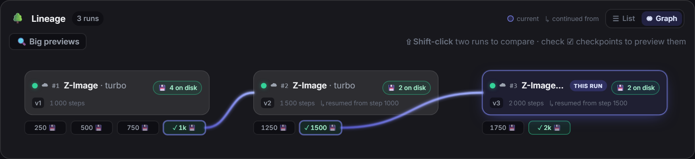
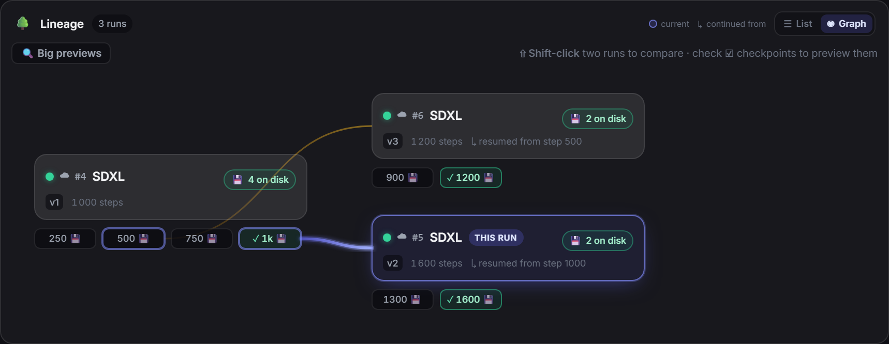

# LoRA Dataset Studio

[](https://github.com/socrasteeze/lora-dataset-studio/actions/workflows/ci.yml) [](https://discord.gg/j6hnJBFtXE) [](https://github.com/sponsors/perfectgf) [](https://ko-fi.com/perfectgf)

**A complete, self-hosted LoRA workflow in one browser tab:** source or generate a Character, Concept or Style dataset, curate it, caption it, clean watermarks, train it on your own GPU, then compare checkpoints before export.

No account, paid tier, API key or telemetry. **This fork runs entirely on hardware you control**: generation is local (Klein/ComfyUI — no Nano Banana, ChatGPT or OpenRouter), and training runs on your own GPU — there is no rented-GPU lane. Generation, the analysis passes and training can each be sent to another machine on your network. Everything else works with no GPU at all.

> New here? Start with [Setup & install](#setup--install), then follow the [end-to-end workflow](docs/guide/workflow.md). The [documentation index](docs/README.md) links every guide. Project news and current development live on [Discord](https://discord.gg/j6hnJBFtXE).

### 📖 [The complete guide — every feature, screen by screen →](docs/guide/using-the-app.md)

Everything the app can do, in one long read: [getting started](docs/guide/getting-started.md) · [the full workflow](docs/guide/workflow.md) · [every setting explained](docs/guide/settings-reference.md) · [Docker](docs/guide/docker.md) · [troubleshooting](docs/guide/troubleshooting.md).

### ▶️ Watch the whole thing, start to finish

A real Character LoRA built end to end in seven minutes, unedited and without narration:

https://github.com/user-attachments/assets/d51ff89c-34e9-41a9-b47d-08939a8c867b

<p align="center">
  
</p>
<p align="center"><em>One workspace for the whole route: a progress rail shows what's done, what's next and exactly what's blocking Train.<br>All screenshots in this README use a synthetic, AI-generated demo person — no real individual is depicted.</em></p>

---

## Everything it does

The big capabilities, each with what's actually inside it. Every block links down to its detailed section.

### 🎨 Build any dataset — Character, Concept or Style

<details>
<summary>📸 See the Character / Concept / Style creation panel</summary>

<p align="center">
  
</p>
</details>

Four ways to fill a dataset, and one choice at creation that rewires everything downstream.

| Capability | What it provides |
|---|---|
| **Curation grid** | Keep/reject, crop, mirror, rotate, zoom, resize, multi-select and non-destructive upscale candidates from either engine — Klein re-renders detail (sharper, but skin and colour can shift), SeedVR2 resolves detail and leaves the original look alone |
| **Identity and composition checks** | InsightFace similarity, score-based auto-triage, framing badges and a live Character composition meter |
| **Model-matched captions** | Prose or booru form selected by target family, with kind-aware Concept leak checks and content-only Style rules |
| **Caption Lab and recovery** | Find/replace, tag frequencies, expanded editing, targeted re-captioning, stoppable batches and reload-proof recovery |
| **External caption round trip** | Export ordinary image/`.txt` pairs, caption them in any tool, then re-import without duplicating images or overwriting non-empty LDS captions |
| **Dual long + short captions** | ai-toolkit text-side augmentation for supported local families; both wordings remain editable per image |
| **Watermark review** | Detect, review and edit masks; choose crop or LaMa/Klein inpaint; every edit keeps an `.orig` backup and **Restore original** supports another attempt |
| Sub-feature | What it gets you |
| :-- | :-- |
| **Character / Concept / Style** | One choice at creation rewires captioning, masking and step-scaling — it isn't just a label |
| **✨ Generate from references** | A local Klein/ComfyUI model, each request wrapped in identity-preservation instructions (this fork is local-only for generation) |
| **Variation catalog** | Character sets fan out expression / angle / lighting / framing / outfit / background without you writing a single prompt |
| **📥 Import your own** | Drag photos in — full frame for Concept/Style, optional auto head-crop for Character |
| **🌐 Scrape the web** | Reddit keyword search, Pexels via its official API, or a supported gallery / album / direct-media URL — into the open dataset, or straight into an **Image bank**. The dataset route filters on the way in (under 768 px, wider than 3:1, near-duplicates are dropped before you see them); the bank route stores what it downloaded and lets the bank's own passes judge it |
| **✏️ Edit the prompt, regenerate** | Every generated tile reopens its exact prompt inline and re-renders through the same engine, identity guard included |

*Details: [1. Decide what you're teaching](#1-decide-what-youre-teaching) · [2. Fill it with images](#2-fill-it-with-images)*

A dataset is the thirty images you train on. A **bank** is the three thousand you had to look at to find them — and looking at three thousand images by hand is where most datasets die.

Point a bank at a folder, or scrape straight into one. It reads what is there **in place**: your files are never modified, moved or renamed, and the single action that does touch the source folder announces itself in capitals before it runs. Then **one pass measures the whole pile**, and every question afterwards is answered against those measurements instead of against your eyes — what is blurry, what is a duplicate of what, who is in it, how it is framed, whether it is a photograph or a render, and what it actually shows. You keep, reject and shortlist; a kept selection graduates into a dataset with its analysis attached, and can come back the other way.

The cuts are measured rather than guessed: the aesthetic and near-duplicate thresholds were calibrated on a real bank of **7,316 images**, and every measure that cannot answer says "unsure" or "not measured" instead of inventing a verdict. The image lane is out of Beta; the **video** lane still carries the chip, and says why below.

<table>
  <tr>
    <td width="62%" valign="top">
      <a href="docs/screenshots/bank/bank-analyze-and-overview.png"></a>
    </td>
    <td width="38%" valign="top">
      <a href="docs/screenshots/bank/bank-launch-all.png"></a>
    </td>
  </tr>
  <tr>
    <td valign="top"><sub><strong>The workspace</strong> — every pass on the left, and on the right what the bank actually <em>is</em>: how much of it each pass has covered, its resolutions, framings, mediums, and how many duplicate and person groups are still unresolved. 50,461 images here, 93% measured for quality, 49% scored.</sub></td>
    <td valign="top"><sub><strong>Launch all</strong> — the whole triage in one go. Every flag quotes what it would reject <em>today</em>, and says out loud that 3,602 images have not been scanned yet, so those counts will grow. Stop it any time; a pass whose tool is missing is skipped, never failed.</sub></td>
  </tr>
</table>

| Capability | What it provides |
|---|---|
| **Guided local training** | ai-toolkit underneath, family-scoped starters, adaptive step policies, launch guards, queueing and advanced controls |
| **Slider LoRA (Beta)** | Train a bipolar conceptual slider from positive and negative prompt poles, so LoRA strength moves the learned trait in either direction and Test Studio can sweep both sides |
| **Merge a LoRA into a checkpoint** | Fold one or more of your LoRAs into a base, each at its own weight, and get a complete model you can publish. A plan answers first, from the file headers alone: how many tensors change, how big the output is, which drive it lands on, how long it takes, and what a half-way failure leaves. What comes out is a **merged** model, not a trained one — the file's own metadata records the base, every LoRA and its weight, so it stays true after a rename. It is also the published route to getting few-step speed back on a Raw full model, by folding in the re-distillation LoRA Krea publishes for Turbo; that one we have not tested ourselves, and the screen says so before you start it |
| **Custom bases and continuation** | Train compatible custom weights, continue from any saved epoch, or use verified full-state resume where available |
| **Runs hub** | Every run together with progress, logs, stop/retry/continue/download actions and paste-safe config sharing |
| **Experiment lineage** | Inspect, annotate and diff the exact tree of runs and the checkpoint each continuation resumed from |
| **LoRA Canvas** | Put every dataset's lineage on one pan/zoom board, rearrange cards, compare runs across datasets, generate from same-family checkpoints — including 🧬 blending several checkpoints into one image, with purple provenance edges joining a blended picture to every pill it came from (blends made before this feature show a badge instead) — pin/fuse outputs and continue training from a pill; each generation run keeps its own strip in training-step order, with the character dataset's reference face on its lane. A 🔌 + LoRA button pins any LoRA from your ComfyUI folder onto the board as its own plugin node, with its own strength — it stacks onto a run anchored by a checkpoint trained here, not as a solo generation on its own. ⏏ **Undeploy** lists every LoRA the app put into ComfyUI, across all datasets and families, and removes the ones you tick in one pass; LoRAs you downloaded yourself are never shown or touched, and training saves remain available for redeployment |
| **Test Studio** | Fixed-seed checkpoint × strength grids, multi-LoRA comparisons or 🧬 combined stacks (several of your LoRAs in one image, each at its own weight, weight variants compared side by side), a ✨ Enhance button that enriches your prompt through your local Ollama, votes, Wilson ranking, face ranking and shareable exports |
| **Studio shortcuts and recovery** | Open Studio directly from a run, draw prompts from kept dataset or Image Bank captions, and pause safely when ComfyUI drops instead of launching later cells against changed state |
| **Local storage controls** | See every local data folder, measure it on demand, move the dataset root safely to another drive, and manage Trash plus the run image archive from one Settings tab |

### 🗃️ Image bank — a giant unsorted folder becomes a dataset

<details>
<summary>📸 See the Image bank grid — quality flags, scores and action zones</summary>

<p align="center">
  
</p>

</details>

Point it at a messy dump of thousands of images and triage it in place. Nothing in your folder is touched unless you explicitly ask — **Delete rejected** is the only action that removes anything, and it tells you where the files will go first.

| Sub-feature | What it gets you |
| :-- | :-- |
| **🎛 Every pass asks first** | A pass button opens a window instead of firing. It says **where the run applies** — kept, undecided, the bin, all of them, or the images you selected, each line quoting the number *it* would touch, so a scope with nothing to do is refused before the click rather than reported as a success after it; **what the calculation reads**, with where those settings live; and **what it does not decide**. Three passes produce one numbering of the whole bank (✨ Score, 👥 Group by person, ✂ Find crops & variants) and therefore refuse a partial scope — visibly, with the reason, rather than by not offering it. "Rescan all" and "Rescore all" are tick boxes in their own pass's window now, next to the pool they re-run and with the cost written beside them |
| **Quality scan** | Flags 🌫 blurry, 📺 noisy, ⬜ flat and 📐 small shots, and groups ≈ near-duplicates with one **keep-best** click |
| **✨ Score** | A LAION aesthetic score, an NSFW probability and a 🎨 style grouping — one GPU pass, all three. **Stopping it keeps what it computed**: the scores already measured are written before it ends, and a relaunch pays only for what is left. The 🎨 style grouping is the one part that needs a whole pass to land, so a stopped run leaves the previous grouping untouched and says so |
| **✂ Find crops & variants** | Catches the same shot re-cropped or re-compressed, reusing Score's embeddings (no extra GPU pass) |
| **🧬 Semantic near-duplicates** | A second dedup pass over the scoring embeddings, catching the near-identical shots pixel hashing cannot see. Its own per-run threshold, and its groups are kept apart from the pixel ones |
| **🧹 Auto-reject by flag** | Turn any set of quality flags into one bulk rejection, on the number it will really reject rather than the number flagged — and take it back as a single decision |
| **🚩 Find & 🧽 clean watermarks** | Flags overlaid logos/URLs with a box, then removes them in two manual passes — a model-free crop, or a LaMa/Klein repaint into a *separate* file |
| **✂ Crop · ✨ Upscale & improve** | Reframe one shot in Review without resampling it, or run a scoped Klein/SeedVR2 upscale pass. Both write a derivative the app owns rather than touching the source; ↩ Revert drops it, restores any absorbed rotation, and clears measurements taken from the old pixels so later passes inspect what the Bank now shows |
| **👥 Group by person** | Clusters faces into people **with no reference photo needed**, GPU-accelerated when the card is free |
| **🏷️ Caption the bank** | Writes the search text, choosing the engine, the Ollama vision model and the pile (Kept, Undecided, the bin, or the images you selected) **for that run only** — your settings are never rewritten. The button quotes the number it will actually write, not the size of the pile. It stays clickable at zero on purpose: the launch window is where the engine and model pickers live, so greying it out used to take them down with it on exactly the bank you wanted re-captioned — the **launch** button inside refuses a run of 0, and says why. Rejected images are only captioned if you aim the run at them. Every caption now records **who wrote it** — JoyCaption, Ollama, or you — so **Re-caption** keeps your own words instead of overwriting them, and states three figures before the click: what it rewrites, what it keeps because you wrote it, and what it overwrites whose author was never recorded (captions written before this existed — those **cannot be recovered**, and undo does not cover captions). Redoing your own captions too is a separate tick box, offered only when there is something to lose. On a compute peer the pass uses **that machine's own captioner**, so the per-run engine/model choice applies to local runs only |
| **🎨 Medium · ⤢ Angle** | Splits a mixed dump into photographs, anime, 3D renders and illustrations, reusing ✨ Score's embeddings (no extra GPU pass), and sorts by head angle from the same face pass that already clusters people. Both answer *unsure* / *not measured* instead of guessing — non-photo verdicts are rare by design, and profiles are under-counted because a hard-turned head often defeats face detection |
| **🔖 Tags** | A local ~400 MB tagger labels what's in each shot — hair colour, clothing, setting — so a huge pile can be sliced by that *before* you spend GPU hours captioning it. Facet dropdowns over the common questions, an **All other tags** list for the rest. Runs on CPU. Never writes captions. **Bank only** (not the dataset workspace), and **cannot run on a compute peer** |
| **🔍 Search & filter** | Full-text search over captions **and 🔖 tags** plus Status / Quality / Score / Groups / Resolution filters with a live count. On a small screen the panel opens folded behind a summary of what's active; **✓ Keep / ✕ Reject** ride along in a bar pinned to the bottom of the screen once anything is selected |
| **🔤 Find by text** | Rank what you're looking at by a written phrase — *"brunette outdoors, wide shot"* — reusing ✨ Score's embeddings. A ranking, not a filter |
| **🎨 Pick diverse · ⚖️ Balanced pick** | Cover the visual space, or spread the pick evenly over face / bust / body / back instead of taking the top of one ranking |
| **📊 Coverage** | The readiness meter says the set is big enough; it does not say it is varied. Coverage reads the labels, the scoring embeddings and the captions to name what the pool never shows — no profile views, one outfit, eye level only. Advice only: nothing is kept or rejected, and anything unmeasurable says so instead of drawing an empty bar |
| **🎚 Thresholds · ↩ Undo** | Retune the twelve numbers behind the flags without leaving the bank, and take the last bulk decision back |
| **▶ Review** | Full-screen, one image at a time, **Keep / Reject / Skip** — for the pile that needs an eye, not a filter |
| **📦 Move folder** | Move a bank's images to another disk and keep every analysis: scores, duplicate groups, faces, decisions, captions |
| **🚀 Launch all** | Runs the whole chain end to end overnight and leaves a morning report |
| **④ Promote · ↑ Import to bank** | Pushes a bank's keepers into a target dataset, or copies a dataset's keepers into a new bank. Both choices retain Dataset-owned captions, curation, framing, watermark and provenance. By default compatible final-file technical analysis is restored; **Start fresh** skips only reuse of prior analysis. Face/Score AI results are intentionally not reused after normalization. |
| **The one destructive action** | Everything above leaves your files alone — 🗑 **Delete rejected** is the single bank action that touches the source folder. It sends the rejected files to the OS trash (or the app's own, or deletes them) behind a type-DELETE confirmation that first states how many files, where they go, and which other banks share that folder. It refuses outright when the folder is also a dataset's |

*Details: [The Image bank](#the-image-bank--triage-a-giant-folder-in-place)*

### Video Bank *(first release — read the limits)*

Turns long source videos into a **video training set**: a flat folder of `.mp4`
clips with matching `.txt` captions, cut to the exact frame count and frame rate
the target model accepts.

| Capability | What it provides |
|---|---|
| **Folder → video bank** | Point a bank at a folder of videos. It is referenced **in place**: no pass ever writes to it, exactly like the image bank. The one thing that adds to it is a scrape you send to that bank yourself |
| **Automatic shot detection** | Finds the cuts with TransNetV2, so a long file becomes individually reviewable shots instead of one blob |
| **Review without waiting** | The grid shows thumbnails; a click plays that shot from the source, so nothing is encoded before you have decided |
| **Target-aware cutting** | Pick the model you are building for and the clip length offers **only counts that model can actually ingest** — Wan wants 4n+1 frames, LTX 8n+1, MiniMax H3 five modulo seventeen, and none of them will tell you if you get it wrong |
| **Encode only what you keep** | Cutting a clip means re-encoding it, so that is paid once, at promotion, for the clips you kept. A bank of 400 shots you triage down to 120 encodes 120 files, not 400 |
| **Fix a bad cut instead of rejecting it** | Trim either bound (by 1 s or one frame *of your source*), split a shot at the playhead, or draw a shot the detector missed. Bounds only — there is no scrubbable timeline. For image-to-video targets the first frame is the conditioning image, so moving a start picks what the model animates from, and the panel says so |
| **Measure every shot, choose your own cuts** | One pass reads every frame and scores stillness, blur, black moments and frozen stretches. Flags mark shots to *look at* — nothing is auto-rejected — and there are **no default thresholds**: a preview shows how many shots each cut would flag against *your* bank's own distribution before you apply it |
| **Sound measured, not assumed** | For the targets that keep an audio track (LTX, MiniMax H3), every shot is scored for **how much of it is silence** and its **level in dBFS** — because a dataset of silent clips teaches the model to be silent and the file on disk gives nothing away. "No track", "silent" and "not measured yet" stay three different answers |
| **Cap one source's share** | Optional cap on how many clips a single file contributes, so a 50-clip set is not quietly three videos over-represented. Keeps each source's earliest clips (same bank, same dataset — not a random sample), and the result reports the share it ended up with |
| **Trim the transition off both ends** | Optional per-export trim of both bounds (0 by default). A clip the trim makes too short for the target's frame count is **dropped, never exported short** — and counted separately from clips that were never long enough, since only one of the two is fixed by lowering the trim |
| **Train it without leaving the app** | A promoted set gets a ▶ Train button that runs it through the ai-toolkit installed here — no export, no hand-written config. It queues behind the same GPU as everything else: a captioning pass, a ComfyUI render or an image training in flight refuses the launch instead of racing it |
| **Shots described in words** | A pass writes what HAPPENS in each shot ("a woman turns and walks away"), which becomes the clip's `.txt` — the prompt it trains on. Captions are drafts: editable per shot, and a re-run never overwrites what you wrote |
| **Spot the shot you already have** | A pass compares every shot to every other and groups the near-identical takes — ten copies of one gesture do not teach a model ten things. Each pile keeps its **sharpest** member unflagged, so you know which one to keep, and flagged shots can be selected and rejected in one gesture. It costs no GPU and no new decode: it reuses the frame vectors *Find a scene* already cached |
| **Spot the watermarked shots** | A logo burned into the same corner of every frame is the most consistent thing in a dataset, so it is the first thing a LoRA learns to draw — and it is invisible at thumbnail size. An optional pass runs the same detector the image bank uses over each shot's sharpest frame and flags what it finds. Needs the watermark detector from Setup; a shot it could not judge is counted apart and reported as one it **could not judge**, never folded into the clean ones |
| **See the bands and the subtitles before the model does** | A subtitle sits in the same rectangle of every frame of every clip from one source, so a LoRA learns it early and then draws letter-shaped gibberish there forever; letterbox bars survive a training crop. An optional pass measures both on three frames of each shot — flat bands on all four sides, and text that HOLDS STILL across those frames, so a shop sign in a pan is left alone as scene content — then reports the rectangle a crop would leave you and how much of the frame that is. Three cuts read it, all empty by default. Reading text needs one small CPU package from Setup; **without it the pass still measures the bands and says so**, rather than reporting a bank with no text in it |
| **Catch the encoding damage the eye misses at thumbnail size** | One ffmpeg sweep per file measures three things the existing metrics are blind to: **duplicated frames** (12 fps anime padded to 24, pulldown — every average stays healthy, the model still trains on each picture twice), **compression blocking** (the macroblock grid of a starved re-encode, measured directly instead of guessed from the bitrate), and **edge blur at full resolution** — which is what an **upscale** looks like, and the sharpness score computes on a 160 px copy where a 480p upscale and a native 1080p are literally the same image. Three cuts, empty by default; the file cards also show each source's codec profile and bits-per-pixel |
| **Find a scene by typing a word** | One pass looks at a few frames of every shot; after it, typing *a woman walking on a beach* ranks the bank instantly and tells you **which second** of each shot matched. Several frames per shot, so a subject that only appears at the end is still findable. It is a **ranking, not a filter** — every shot scores something against every phrase — and the model **ignores "without"**, so `-word` pushes something down instead |
| **Label what the camera did** | A CPU pass tracks every frame of every shot and names the movement — pan left/right/up/down, zoom in/out, static shot, handheld shot — in the same vocabulary the video trainer itself uses, plus three of this app's own: rolling, slideshow and subject moves. The labels ride on the thumbnails and as a 🎥 Camera filter row that composes with the ⚑ flags. **Nothing is ever rejected on them** — the wobble one person filters out is what the next person is training on. Honest limits: a pivot and a slide look identical in a flat picture so both read as a pan, orbits are not detected at all, and a pan across a blank wall can read as a slideshow |
| **Find the shots that are secretly two shots** | A dissolve or a match cut leaves behind a "shot" that is really two scenes, and the thumbnail looks fine. Every shot now gets a scene-coherence number at the tail of 🔎 Find scenes — no decode, no model, no GPU, no button, because it reuses vectors that pass already cached. A **ranking, not a verdict**: measured duration-matched, AUC 0.719, so a 0.80 cut catches about a third of the missed cuts and flags about one honest shot in seven. Empty by default, and the panel says so |
| **Triage a bank one keystroke per shot** | ⌨ Burst mode puts a cursor on the grid: K keeps, R rejects, P puts a shot back to untriaged, S or → moves on, ← steps back, U undoes ten deep. The same keys as the image bank's ▶ Review, so the reflex carries. The cursor jumps to the next shot you have not judged, never wraps silently, and keystrokes never wait on the network |
**What it does NOT do yet**, plainly:

- **"Most varied" selection is still to come.** Shots do carry a look score now
  (the same LAION aesthetic scale as the image bank, read off the vectors 🔎
  Find scenes already caches) — but diversity-aware picking is not built yet.
  Searching by words ranks shots by what they LOOK like, which is a different
  question from whether they are any good.
- **Near-duplicates are found, but the threshold is inherited, not measured on
  video.** ✂ Duplicates groups shots at a cosine cut carried over from the image
  bank's own calibration over the same CLIP space; no video-pair calibration
  exists yet. It also compares two shots at their *closest* pair of frames, which
  reaches any given cut more easily than a single-image comparison — so on a bank
  of similar-looking material, expect to raise it.
- **No audio captioning, and no audio in the search.** The sound is measured
  (silence and level) but never described, and 🔎 Find scenes reads frames only —
  "a door slamming" describes nothing it can see.
- **Captioning is per-shot prose, not tags.** Every promoted clip gets a `.txt`:
  its caption when it has one, and an **empty** file when it does not. The file is
  always written, because a missing one crashes one trainer and makes another drop
  the clip silently — and an empty one trains uncaptioned, which is why the build
  dialog counts them out loud before encoding.
- **Training starts here, but only one target is proven here — and locally
  only.** A promoted set has a **▶ Train this dataset** button that hands the
  clips to the ai-toolkit installed on your machine. The eight offered targets
  (Wan 2.1 T2V and I2V, Wan 2.2 T2V and I2V A14B, Wan 2.2 TI2V-5B, LTX-2 and 2.3,
  MiniMax H3) are exactly the video architectures that ai-toolkit ships, and each
  one's settings were read in its code — plus a "Generic / other" escape hatch
  that imposes no frame rule at all. But **Wan 2.2 14B is the only one a finished
  run has been through here**, and the card says so on the others. Measured on
  that run: 24 GB was full, at 170-185 s per step, with the CPU offload that makes
  24 GB possible at all. Only three bases are stated by anything installed
  locally, so **five of the eight need you to name a base repository** — both
  I2V Wan variants, Wan 2.2 TI2V-5B, and both LTX-2 versions. (Upstream also
  offers a rented-pod cloud lane for this; this fork trains locally only — see
  Divergence 4 in FORK_NOTES.md.)
- **MiniMax H3 needs about 43 GB of weights, and will say so rather than fetch
  them.** They come from `Comfy-Org/MiniMax-H3`. If they are not on your disk the
  button names the repository and the size and waits for a yes — a first run that
  quietly downloaded 43 GB would look like a training that had hung.
- **MiniMax H3 is licence-restricted.** Its community licence grants no rights in
  the EU, the UK, South Korea or the USA, and the restriction covers the model's
  outputs, not only the model. Check your own territory before using that profile.


### ✂️ Curate down to the keepers

<details>
<summary>📸 See the curation grid with framing and face-similarity badges</summary>
<p align="center">
  
</p>

</details>

A grid built for real curation work, not a file explorer — with a numeric answer to "is this even the right person?".

| Sub-feature | What it gets you |
| :-- | :-- |
| **Grid actions** | Resize, zoom, crop, mirror or rotate a tile — losslessly, in the file's own format — then multi-select to Keep / Reject / Undecide, clear captions, delete, or Improve via Klein |
| **👤 Face-similarity scoring** | InsightFace scores every image against your reference and badges it green (strong) or orange (borderline) |
| **Auto-triage** | Applies a score threshold to undecided, scorable images — re-appliable, and a manual status change wins |
| **📐 Auto-framing badges** | A local vision model tags each image face / bust / body / back |
| **12 · 6 · 6 · 1 composition meter** | Tracks a Character set's framing mix against the target and names what's still missing |
| **Reload-proof batches** | Long server-side batches (captioning, face, framing, watermark) pick themselves back up after a page refresh |

*Details: [3. Curate down to the keepers](#3-curate-down-to-the-keepers)*

### 🏷️ Caption for the model

<details>
<summary>📸 See the caption engine and vocabulary options popover</summary>

<p align="center">
  
</p>

</details>

Captions are what training actually reads — written for you in the shape your base model wants.

| Sub-feature | What it gets you |
| :-- | :-- |
| **Model-matched form** | Prose for Z-Image / Krea 2 / FLUX.1 / FLUX.2 Klein, booru tags for SDXL, EITHER for Anima (hybrid-prompting — both are native, neither is flagged) — chosen from the target model |
| **Engines** | JoyCaption (via ai-toolkit) or an Ollama vision model, picked per dataset |
| **⚙️ Options** | Choose or **pull** the exact Ollama vision model and remember it on the dataset |
| **Vocabulary preset** | Explicit / Clinical / Safe naming of nudity, plus your own free-text wording instructions |
| **Kind-aware rules** | Concept captions invert and are leak-checked; Style requires a content-only caption per kept image |
| **Sweep the set** | Find/replace with frequencies, tag hide/isolate, an expanded editor, bulk caption clearing |
| **Dual captions (long + short)** | Train each image on both wordings via ai-toolkit's `short_and_long_captions` (local training only; not on Krea 2 / Anima, which cache their text embeddings) |

*Details: [4. Caption for the model](#4-caption-for-the-model)*

### 🧽 Scrub watermarks

<details>
<summary>📸 See the watermark Review lightbox in action</summary>

<p align="center">
  
</p>

</details>

Left in, a site logo is something the LoRA learns. Find → Review → Clean, one image at a time.

| Sub-feature | What it gets you |
| :-- | :-- |
| **🧽 Find watermarks** | Flags overlaid logos/URLs/usernames with a box — it deletes nothing. Two local engines, picked in **Settings ▸ Captioning & quality ▸ Watermark detection**: a dedicated **detector** (fast, returns a score) or a **Qwen3-VL** vision pass. *Auto* takes the detector when its extra is installed and the vision model otherwise, which is what shipped — pinning the detector without the extra runs the vision model rather than failing, and says so. Datasets and banks now read the same setting; they used to disagree silently |
| **⏹ Stoppable** | A scan can be stopped after the image in flight — everything already found is kept, and running it again picks up where it left off |
| **Crop border marks** | A pure pixel crop that invents nothing and never cuts a side below 768 px |
| **Inpaint off-centre marks** | LaMa (fast, local) or the Klein engine (LaMa pre-fill + a FLUX.2 Klein refine pass, composited back in pixel space) |
| **🔍 Review flagged · ✕ Reject all flagged** | Step through each flag with its box drawn on the shot — clean it, dismiss a false positive, or reject the image — or drop the whole flagged pile at once. The bulk button quotes what it will *really* reject (rescue rows and failed rows excluded) and names the way back: rejected images stay on disk, and **Show ▸ Rejected** then **✓ Keep** returns any of them |
| **`.orig` backup** | Every edited image keeps its watermarked original as a sibling file |

*Details: [5. Scrub watermarks](#5-scrub-watermarks)*

### 🎓 Guided training — on your own GPU

<details>
<summary>📸 See the researched training presets picker</summary>

<p align="center">
  
</p>

</details>

[ai-toolkit](https://github.com/ostris/ai-toolkit) runs underneath; the recommended path needs no config file.

| Sub-feature | What it gets you |
| :-- | :-- |
| **Six families** | Z-Image, SDXL, Krea 2, FLUX.1, FLUX.2 Klein and Anima (anime, local-only for now), each with its own safety checks |
| **18 built-in training starters** | A Character and Concept recipe per family (plus Style for five of the six), plus a scoped Krea 2 Raw · LoKr likeness community starting point; each says where its choices come from and why |
| **Adaptive step policies** | Character ≈120 steps/image, Concept `475 × √images`, Style 50 steps/image inside a safe envelope |
| **Readiness & launch guards** | Image counts, untriaged rows, suspicious captions, duplicates, VRAM, disk and family compatibility, re-checked at launch |
| **⚙ Advanced controls** | Rank/alpha, resolution, LoRA or LoKr, dropout, timestep weighting, optimizer, scheduler, EMA, save/sample cadence |
| **Training queue** | Runs line up instead of colliding on the GPU, with a protected **⏹ Stop training** |
| **Custom base weights** | Train on your own compatible base — any family, on your own GPU |
| **🎚 Slider LoRA (Beta)** | A bipolar LoRA whose ±strength dials a trait at inference, on a fixed 1000-step policy |
| **Masked training** | Character trains on auto-generated rembg person masks; Concept and Style force person masking off, and Concept can opt into **face** masking instead (learn the act, not the identities) |
| **Train on another machine** | Send a run to a second box's GPU through your ai-toolkit; the dataset goes over, the log, preview samples and checkpoints come back into the folders a local run uses. Always starts fresh there — previous checkpoints are not sent |

*Details: [6. Train](#6-train--guided-advanced-when-you-need-it). Training needs a GPU — on this machine, or on another one you point it at; see [Minimum requirements](#minimum-requirements).*

### 🧬 Experiment Lab — the run family tree

<details>
<summary>📸 See a run's lineage drawn as a family-tree graph</summary>

<p align="center">
  
</p>

</details>

Every continuation and fork drawn as a lineage graph you can inspect, diff, annotate and act on.

| Sub-feature | What it gets you |
| :-- | :-- |
| **☰ List ↔ ◉ Graph** | A compact list or a left-to-right family tree with the path to the run you're viewing lit up |
| **Checkpoints as pills** | Each run shows its saved epochs, and a continuation's edge starts on the exact checkpoint it resumed from |
| **Inspect a run** | The exact settings it trained with — rank, alpha, LR, optimizer, timestep, base, EMA… |
| **Diff two runs** | Shift-click two nodes and compare their configs side by side, only the differences highlighted |
| **Notes** | Annotate any run or checkpoint (● marks the annotated ones) |
| **Per-checkpoint previews** | Same prompt, same seed, one preview per epoch — with a 🔍 big-preview grid to spot the sweet spot before it overcooks |
| **Act from a pill** | ⬇ download that epoch, 📦 import it into ComfyUI, or ▶ continue from here |
| **Honest reconstruction** | Older continuations reconnect automatically; runs whose files are gone are tagged, never invented |

*Details: [7. Read the family tree](#7-read-the-family-tree)*

### 🧪 Test Studio — pick the best checkpoint

<details>
<summary>📸 See the Test Studio comparison grid</summary>

<p align="center">
  
</p>

</details>

A LoRA that's *trained* isn't necessarily a LoRA that's *good*. Compare them on a fixed seed. (Z-Image, SDXL and Krea 2 today.)

| Sub-feature | What it gets you |
| :-- | :-- |
| **Checkpoint × strength sweep** | 0 → 2.0 by default, an over-cook range up to 5.0, and negative strengths down to −2.0 for slider LoRAs |
| **Multi-LoRA grids** | Select several LoRAs of the same family and compare them against strength |
| **🔎 Describe** | Drop any image and the local Ollama vision model turns it into a test prompt — never the identity or trigger |
| **🎲 Caption** | Choose a dataset once, then use a random nonblank caption from one of its kept images as the test prompt; ▾ changes the source and typed text is confirmed before replacement |
| **Vote & rank** | Quick votes feed a Wilson ranking; Character results can also be ranked by face similarity |
| **Export the grid** | One labeled image ready to post — the composer works even with ComfyUI offline |
| **Flip in place** | Swipe, ‹ › buttons or arrow keys with wrap-around; strength variants sit adjacent |

*Details: [8. Pick the best checkpoint](#8-pick-the-best-checkpoint)*

### 📦 Take it with you

Nothing here locks your data in — every stage has an exit.

| Sub-feature | What it gets you |
| :-- | :-- |
| **Training ZIP** | Kept `image` + same-stem `.txt` pairs for ai-toolkit/Kohya, or sidecars written beside the images |
| **Merge existing data** | Import a training ZIP or recursively merge a local folder; perceptual duplicates are skipped |
| **💾 Back up everything** | Every dataset, its training history and your settings in one portable file (API keys excluded), Trained state restored |
| **Hugging Face publishing** | Publish kept images and captions as a dataset repository — private by default |
| **📦 Import into ComfyUI** | One click for any checkpoint a run produced |
| **🗑 Trash** | Everything the app deletes lands there and stays recoverable until you empty it |

*Details: [9. Take it with you](#9-take-it-with-you)*

### 🖥️ Local & private, start to finish

Nothing leaves this machine unless you send it there yourself, and every feature **degrades gracefully** — it stays hidden until its dependency (a reachable tool, an installed extra) is satisfied. See the [feature matrix by backend](#feature-matrix-by-backend) and [Run it your way](#run-it-your-way).

---

### ❤️ All of that is free, and stays free

No paid tier, no account, no tracker, nothing gated behind a donation — and that
won't change. It's one person's personal time, and the upstream project this fork
tracks carries the hardware and API bills behind every lane that gets tested
before it reaches here.

If this saves you an afternoon, [**buy a coffee on Ko-fi**](https://ko-fi.com/perfectgf)
or [**sponsor on GitHub**](https://github.com/sponsors/perfectgf). Can't chip in?
A ⭐ on the repo, a precise bug report, or an idea on [Discord](https://discord.gg/j6hnJBFtXE)
helps just as much — [more on that below](#support-the-project).

---

## The pipeline, at a glance

This README follows the app itself: the road you actually walk, from an empty dataset to a ranked, exported LoRA. Each stop below links to the section that details it — read top to bottom, or jump straight to the step you're on.

| Stop on the road | What you do there |
| :-- | :-- |
| **[1 · Decide what you're teaching](#1-decide-what-youre-teaching)** | Pick Character, Concept or Style — the choice rewires captioning, masking and step-scaling downstream. |
| **[2 · Fill it with images](#2-fill-it-with-images)** | Generate from references through the local Klein/ComfyUI engine, import your own, scrape the web, or triage a giant unsorted dump in the **Image bank**. |
| **[3 · Curate down to the keepers](#3-curate-down-to-the-keepers)** | Keep/reject on a real curation grid, with face-similarity scoring, auto-triage and a live composition meter. |
| **[4 · Caption for the model](#4-caption-for-the-model)** | Prose or booru tags, model-matched and machine-written, with a Vocabulary preset, a Caption Lab and full find/replace. |
| **[5 · Scrub watermarks](#5-scrub-watermarks)** | Find overlaid logos/URLs, then crop or inpaint them (fast LaMa or Klein quality) behind a review step. |
| **[6 · Train](#6-train--guided-advanced-when-you-need-it)** | Guided training over six families and eighteen configuration starters, adaptive steps and guards, sliders — on this machine's GPU, or another machine's. |
| **[7 · Read the family tree](#7-read-the-family-tree)** | Every continuation and fork drawn as a lineage graph you can inspect, diff, annotate and preview. |
| **[8 · Pick the best checkpoint](#8-pick-the-best-checkpoint)** | Sweep checkpoint × strength in **Test Studio**, vote, rank, and export a shareable grid. |
| **[9 · Take it with you](#9-take-it-with-you)** | Training ZIPs, portable backups, merges, Hugging Face publishing, one-click ComfyUI import. |

### Recent improvements

- **🗃️ An overnight bank queue now survives a reboot** — ⏳ Queue all used to keep its line-up in memory only. Queue eleven banks, let the machine restart for an update, and by morning the panel was empty with no row, no log line and nothing saying work had been dropped — you found out by noticing the GPU hours had not happened. The queue is stored now: it comes back on start-up and carries on, a bank that was mid-run returns as pending and re-runs (committed scores stay, so it only pays for what is missing), and **the machine each bank was sent to survives too** — a restart no longer quietly pulls the whole queue back onto this computer.
- **🎓 Train on your other machine’s GPU** — a run no longer has to tie up the box you are working on. Put your ai-toolkit's web address in **Settings → Training** and a **Train on** picker appears beside *Train the LoRA*, listing the machines that ai-toolkit knows about. Pick one: the dataset is staged over, the run starts there, and its **log, preview samples and checkpoints all arrive back here** as it goes — written into the same folders a local run uses, so the Training panel, the checkpoint browser and the Runs page work on it exactly as on a local run, **⏹ Stop** included (and what it had already saved comes home before it closes). **Base models are never copied**: the machine that trains downloads its own weights with its own Hugging Face token, so only your dataset and the job config cross the network. The readiness guards are identical either way — a dataset does not become well-formed by being trained elsewhere. Three limits, stated rather than discovered: the picker offers **other** machines only (a remote run does not hold this machine's GPU-busy flag, so generation would start on top of it — *This machine* stays the local path), a run sent elsewhere **always starts fresh** because previous checkpoints are not sent, and **one run per dataset** at a time. A machine that is switched off is listed and greyed out with the reason, not hidden.
- **🖥️ Rent another machine’s GPU without moving your datasets** — two ways, both in **Settings → Devices** and both feeding the same **Run on** picker. The light way: the other box runs **only ComfyUI** (`--listen`) and you paste its URL as a **remote backend** — no second install, no token, renders in parallel with this machine and keeps going while a training holds the local GPU; ComfyUI’s API has **no auth**, so trusted networks (Tailscale, home LAN) only. The full way: install the app there too and join it as a **compute peer** — token-gated and revocable. The two are **not interchangeable**, and the picker labels which is which: a **backend renders images only**, while a **peer also runs the bank's heavy passes** — ✨ Score, 👥 Faces, 📐 Framing, 🚩 Watermarks **and 🏷️ Captions** all move to its GPU, using its own models and its own captioner — each one only if that machine reports the stack for it, and the ones it cannot are greyed out before you launch rather than failing an hour later. A bank sent there runs **in parallel** with local work. **Work already done is not done twice**: ✨ Score and 👥 Group by person send this machine's embeddings cache along, so the other box computes only what is missing — and the images it can skip are not uploaded at all. An image edited since it was scored is sent again. Pressing **Stop** waits a moment for that machine to hand back what it finished, and the bank says how much was kept; relaunching carries on from there. A bank's scan, auto-reject and duplicate steps always stay on the Primary (those read the database, not the GPU). The models for a job must exist on the machine that runs it.
- **🔤 Find images in a bank by describing them, and pick a set that actually covers your framings** — three things the Bank could not do. **🔤 Find by text** ranks what you're looking at against a phrase (*"brunette outdoors, wide shot"*), reusing the embeddings ✨ Score already computed — no new model, no download, no GPU. **⚖️ Balanced pick** spreads a selection evenly over face / bust / body / back instead of returning the top of one ranking: on a real bank, "the 20 most varied" had been giving **0 face shots and 0 back views**, silently. And **🎨 Pick diverse** stopped spending its first picks on memes and strangers — "most spread out" was computed as "most isolated", which are not the same thing. All three state their own limits rather than looking confident: the text search is a **ranking, not a filter**, it cannot count and it **ignores "without"**; a balanced pick **names the framing it could not fill** instead of padding it.
- **↩ Take back a bulk decision, and retune the filters where you're triaging** — marking 400 images by mistake used to be permanent. ✓/✕ over a whole filter, auto-reject at a threshold, collapsing duplicate groups and 🚀 Launch all now leave an **↩ Undo** bar that survives a page reload, with its limits printed on it: one step, and only until the app restarts. 🗑 Delete rejected and ⬆ Promote deliberately offer nothing — neither can be undone honestly. Alongside it, the **twelve thresholds** behind every Bank flag moved under the filter chips as **🎚 Filter thresholds**: each says which direction catches *more* images (the duplicate distance and the semantic similarity move opposite ways), when it takes effect, and how many images the value you're typing would flag — before you save.
- **◉ Every run you have ever trained, on one board** — lineage graphs used to be locked inside a single run's card: one dataset at a time, in a fixed frame. The new **Canvas** tab puts every dataset you have trained on one surface you can zoom and pan — each dataset a lane, each run a card, and a continuation joined to the exact checkpoint it resumed from. **Drag the cards where they make sense to you** and they stay there; a new run slots into free space without disturbing your arrangement, and `✦ Tidy up` gives you the automatic tree back. Click checkpoints across *different datasets* to generate from them in one launch — same prompt, same seed — with the full Test Studio settings, and each checkpoint keeps a gallery of everything ever rendered from it.
- **🧬 A second local engine that keeps a face from one photo** — **Krea 2 Edit** joins Klein as a free, on-your-GPU way to build a dataset: give it one reference photo and it restages that person into the shots you picked — new angles, new poses, new scenes — with no character LoRA needed, because there isn't one yet. Identity, marks and piercings survive the move; a `reference grounding` dial trades likeness against how literally the shot description is followed. It needs two files placed by hand (a node pack and an editing LoRA) — the app checks for them and, when they are missing, names each one and where it goes rather than failing at generation time.
- **⚡ "Run the test" starts a grid in a fraction of the time** — launching a Test Studio grid used to re-read the workflow template, re-scan your LoRA folder and write to the database **three separate times for every cell**, then ask ComfyUI for its full node list **twice** (that answer weighs about 9 MB — 4.8 seconds each time). A cell is now one write, the folder is scanned once, and the node list is fetched once and reused: measured on a 50-cell grid, 150 database writes became 50 and the launch itself 129 ms → 56 ms, on top of the duplicate probe disappearing.
- **Anima — a first-class anime training family** — the anime-focused **Anima** model (2B, on the Cosmos-Predict2 architecture) is now a full training family: pick it like any other, with its own default recipe (extrapolated from ai-toolkit's own defaults — no Anima-specific community study exists yet) and safety checks. Anima is **hybrid-prompting**: its model card documents booru tags AND natural language as equally supported, so LDS accepts either and flags neither (captions default to prose; switch with the prose/booru selector). It trains **locally** on an up-to-date ai-toolkit ([support merged upstream](https://github.com/ostris/ai-toolkit/pull/860)).
- **Stop buttons you can trust** — a full pass over every Stop/Cancel in the app. **Stop generation** is clickable for the whole batch (it used to grey itself out exactly when you needed it), **Stop training** now *verifies* the training process actually died before reporting success (an unkillable process returns an honest error instead of a false "stopped"), and a cancelled render that ComfyUI never confirmed aborting is reported as such instead of silently claimed. A false "may still be running" warning that fired on perfectly normal cancels was also silenced.
- **No more silent hangs or GPU pile-ups** — an audit of every blocking call and pause path: a stalled Ollama model download now fails with a clear error instead of hanging its setup task forever, and very long caption/vision batches no longer lose their exclusive GPU lock mid-run (which could let queued image generations pile onto the GPU while captioning was still working — the lock now renews itself for as long as the batch runs).
- **Startup opens the real address** — serving on a LAN or Tailscale address used to greet you with a browser tab at a hardcoded `127.0.0.1`, opened before the server was even up ("cannot connect" every launch). The launcher now opens the address it is *actually* serving on, only once the server accepts connections, with the access token carried along when the token gate is on. Set `LDS_NO_BROWSER=1` to skip the auto-open.
- **Run lineage & family-tree graph** — when you continue a training (from its last checkpoint or an earlier, less-cooked epoch) a lineage is born: the original run, its continuation, the re-continuation, any branch you forked off. The Runs page draws it two ways — a compact **List** and a **Graph**, a left-to-right family tree with flowing connectors and the path to the run you're viewing lit up. The graph shows each run's **checkpoints as pills**, and a continuation's connector starts from the **exact checkpoint it resumed** — click any checkpoint to **download** it or **continue from here**. It opens for a single run the moment it has one saved checkpoint (also from a dataset's Checkpoints & LoRAs panel), and older continuations are **reconnected automatically** on first start — anything too ambiguous is left as a root, never invented.
- **Image bank (Beta) — a giant unsorted folder becomes a dataset** — point the new **Bank** tab at a huge, messy dump (a Telegram export, a scrape pile): a quality scan flags blurry/noisy/flat/too-small shots, near-duplicates group up with one **keep-best** click, and a face pass sorts everything **by person — no reference photo needed** (now **GPU-accelerated** when the card is free). Then **Score** rates aesthetics, flags NSFW and groups by visual style, **Find crops & variants** catches the same shot re-cropped or re-compressed (reusing Score's embeddings, no extra GPU pass), **Find watermarks** flags overlaid logos/URLs, **Caption** describes images right in the Bank and a **search** filters a 9,000-image dump by what's in it. Any captioned tile's 🏷️ badge lifts that image's own words into the filter bar as tickable chips, so "more like this one, and I can see why" is one click — several chips mean AND, and each matches as a whole word. It only finds what a captioner actually wrote down, and a prose caption yields separate WORDS, so "golden hour" becomes two chips. A per-subfolder scope slices a big export by chat — importing a folder of folders can make **one bank per subfolder**, with any of them **unticked** to leave it out — and a **Browse** button opens your own folder dialog. Two banks given the **same name** show as one card with combined counts, one queue action and one promote, while their files stay in their own folders on their own disks. Your source folder is never modified; promote the keepers straight into a dataset. **Launch all** runs the whole pipeline end to end while you sleep, with a morning report.
- **Sharper training recipes from verified research** — two defaults re-tuned from a fact-checked sweep of recent community results: a **FLUX.2 Klein style** LoRA now trains the winning **128/64/64/32** network (a 64-run sweep and Black Forest Labs' own example converge on it), and **Slider** LoRAs default to **alpha 4** (matching the Ostris slider notebook). Both are just smarter defaults — existing runs are untouched, and Advanced options still lets you set the alpha back.
- **Per-dataset caption options** — a new **Options** button in Captions lets you pick the engine (Auto / JoyCaption / Ollama vision), choose or **pull** the exact Ollama vision model, set a **Vocabulary** preset for how nudity is named (Explicit / Clinical / Safe), and add your own wording instructions — all remembered on the dataset and layered on top of the built-in guardrails.
- **"Update & restart" now works for ZIP installs** — installed from a release ZIP with no Git? The update button used to just send you off to download by hand; now it names the release and its size, **downloads and installs** it with a live progress bar, keeps your datasets, settings, `.env` and Python environment intact, and **rolls back automatically** if anything fails. Git checkouts update exactly as before.
- **A one-click install step in Setup** — after you configure your services, **Install everything** queues every installable component (ML extras, the Ollama vision model, Klein weights) with a live **X / N** progress bar; heavy installs run one at a time so they never clash. A per-item menu stays available with a **Reinstall** on each, to repair a single broken component without redoing the rest.
- **Back up everything — Trained state included** — a **Back up everything** button packs every dataset (images, captions, statuses, references), its training history and your settings into one file (API keys deliberately excluded). Restore rebuilds every dataset without overwriting, and now brings back each one's **Trained** status and run history instead of "Not trained yet". Tick **Include trained LoRAs** to bundle the `.safetensors` themselves.
- **Dual long + short captions** — a new Advanced option turns on ai-toolkit's native long+short captioning: every image trains with a full caption **and** a brief one, so the LoRA leans less on any single wording. The short variant is written for you from the long one (same rules, no trigger) and is editable per image. Local training only for now.
- **Klein 9B KV by default** — new installs download the **public** KV build: up to **2.5× faster** multi-reference editing at identical quality, and **no Hugging Face token needed** for generation. Existing installs keep their current file; nothing re-downloads.
- **🛡️ Your files are harder to lose** — **Delete rejected** was the one action in the app that could destroy photos for good. It can't any more: files go to your OS Recycle Bin, and when that isn't available (`send2trash` isn't installed by default) they go to the **app's own Trash**, recoverable until you empty it — a permanent delete only happens when neither can take the file, and the confirmation says which of the three you are about to get *before* you arm it. It also refuses to be quiet about the case that actually bites: two banks pointing at the same folder, **or one nested inside the other**, where deleting from one amputates the other.
- **📦 Move a bank to another disk without losing a single analysis** — a full bank represents hours of GPU time. **📦 Move folder** lets you move those images to a bigger drive and repoint the bank at them: every aesthetic score, duplicate group, face verdict, caption and keep/reject decision survives, because only the folder path changes. It previews the match before it commits, and it accepts a path pasted exactly the way Windows' *Copy as path* gives it to you — quotes and all.
- **🧽 Banks now remove the watermarks they find, in two manual passes** — a **crop** that cuts the mark off with no model involved at all, and a **repaint** (LaMa, or the Klein engine for quality) for marks a crop can't reach. Your file is never opened for writing: the clean image is a separate copy, so **↩ Undo** is one click and the original is still byte-for-byte what you downloaded. Alongside it, **▶ Review** walks the pile full-screen — one image, **Keep / Reject / Skip** — and a bank re-inventories its folder on its own, so images you drop in after creating it simply appear.
- **⚡ Twice the speed on the long passes** — the bank's vision passes (watermarks, framing, captions) now send several images to Ollama at once instead of queuing them: **2.03× faster** measured at the default of 4 in flight, tunable in **Settings → Local tools → Ollama**. And **✨ Score** can **borrow a CUDA-capable Python you already have** (ComfyUI's, ai-toolkit's, your own) instead of downloading ~2.5 GB of CUDA wheels for a second copy — the app lists what it can find and you pick.
- **📥 Bring your own shot catalog, and real catalogs for non-humans** — the variation catalog **imports and exports as JSON**, so any LLM can write a shot list for your subject; the import panel shows what would land and **names every entry it refused, with the reason**, before anything is added. The non-human subject types stopped being stubs: **59** shots for animals (up from 16), **40** for creatures, **30** for objects, **22** for other. A one-off shot you type in can also be **Kept** — it moves into the durable catalog server-side instead of dying with your browser cache.
- **🔎 A failed run tells you what killed it** — the failure panel quotes the line that actually explains the crash instead of whatever warning was printed last, and the **RTX 50-series PyTorch trap** (a `sm_120` card meeting a torch build that stops at `sm_90`) is recognised by name with its fix. A run that dies in the first seconds still hands you an **Open run folder** button pointing at its log.

Much of the above came from people reporting things in public: **wannadecryptor**, **ashish.sinha**, **bbsorry**, **vykas22**, **axelf_**, **vvilams**, **naniii2352**, **j_o_e_l** and **zigzag4794** on Discord, **bobba84**, **strouder**, **shivdbz2010** and **1Tomber** on GitHub, **Psyko_2000** on Reddit. Older improvements roll into [CHANGELOG.md](CHANGELOG.md).

### Roadmap

Directions, not dates. These are discussed openly on the project's Discord, and the most-requested ideas move up the list.

- **🧬 Merge Lab** *(partly shipped)* — baking your LoRAs into a standalone checkpoint has landed. What is left is the *lab* part: **model ↔ model** merges with guided recipes, judged side by side in the Test Studio (same seeds, A/B grids). Full-model (dense) training is **not** part of this fork at all — see the backend matrix below.
- **🎬 Video LoRAs** *(landed, locally)* — *the dataset half exists and training now launches from the app* (see **Video Bank** above): shot detection, quality measures (motion, exposure, freeze, audio), captions that describe the action, keyword search across shots, target-aware cutting into a trainable folder, and a ▶ Train button that runs the set through your local ai-toolkit. What remains is proving the targets beyond Wan 2.2 with a finished run each, and testing the resulting LoRAs in-app. Community-driven.
- **🧠 Watermark cleaning during import** — cleaning that happens **during import** instead of as a separate errand, and automation you can trust unattended. *(Detection has caught up: a dedicated detector that needs no vision model now ships alongside the Ollama path, and manual two-pass cleaning already works in datasets and in the Image Bank.)*
- **🧩 More base models** — additional Flux-family bases (Chroma, Qwen-Image…) with the same one-click flow as Krea 2.

### Table of contents

- [Everything it does](#everything-it-does)
- [The pipeline, at a glance](#the-pipeline-at-a-glance)
  - [Recent improvements](#recent-improvements)
  - [Roadmap](#roadmap)
- **The funnel, one step at a time**
  - [1. Decide what you're teaching](#1-decide-what-youre-teaching)
  - [2. Fill it with images](#2-fill-it-with-images)
  - [3. Curate down to the keepers](#3-curate-down-to-the-keepers)
  - [4. Caption for the model](#4-caption-for-the-model)
  - [5. Scrub watermarks](#5-scrub-watermarks)
  - [6. Train — guided, advanced when you need it](#6-train--guided-advanced-when-you-need-it)
  - [7. Read the family tree](#7-read-the-family-tree)
  - [8. Pick the best checkpoint](#8-pick-the-best-checkpoint)
  - [9. Take it with you](#9-take-it-with-you)
- **Reference**
  - [Why this instead of ai-toolkit?](#why-this-instead-of-ai-toolkit)
  - [Feature matrix by backend](#feature-matrix-by-backend)
  - [Run it your way](#run-it-your-way) — full local, existing-ComfyUI Docker, **Docker (CPU or GPU)**
  - [Setup & install](#setup--install)
    - [Docker + your existing ComfyUI](#option-3--docker--your-existing-comfyui)
    - [Docker (GPU + ComfyUI)](#option-4--docker-gpu--comfyui)
  - [Minimum requirements](#minimum-requirements)
  - [Configuration & settings reference](#configuration--settings-reference)
  - [Exposing the app beyond localhost](#exposing-the-app-beyond-localhost)
  - [Known limitations](#known-limitations)
  - [Troubleshooting](#troubleshooting)
  - [Support the project](#support-the-project)
  - [Legal & responsible use](#legal--responsible-use)
  - [Contributing](#contributing)
  - [License](#license)

> 📖 **New here?** The **Guide** tab inside the app is a 5-chapter manual: getting started, day-to-day usage, dataset quality (also readable as [docs/DATASET_GUIDE.md](docs/DATASET_GUIDE.md)), troubleshooting, and how to report problems — with a one-click diagnostic report. The chapters live in [docs/guide/](docs/guide/) if you prefer reading on GitHub.

---

## 1. Decide what you're teaching

Everything downstream keys off one choice at creation: **Character**, **Concept** or **Style**. It's not just a label — it rewires how the app captions, whether it masks, and how it scales training steps (the creation panel is pictured at the top of this README).

- **🧑 Character** — pin an identity from one reference photo. Character LoRAs use an **activation trigger**: captions keep variable details (expression, angle, outfit) promptable while the omitted invariant — the face — binds to that token. The app can fan out a **53-shot variation catalog** (expression / angle / lighting / framing / outfit / background) so the set spans close-up to full-body without you writing a single prompt, and it runs **masked training** from auto-generated person masks. Step budget: roughly **120 steps/image** (clamped 1500–3500), and a live **12 face · 6 bust · 6 body · 1 back** composition meter rides along the whole time.
- **💡 Concept** — train an *object or action* instead of a person. Captioning **inverts**: it describes everything *except* the concept and checks that the concept name did not leak back into the text, so the invariant binds to the trigger. Person masking turns itself **off** so it can't erase what you're teaching — and you can opt into **face** masking instead, which weighs the faces down in the loss so the concept stops competing with your character LoRAs (idea from a community report). Steps scale as **`475 × √images`** (clamped 2000–12000), the shape that matches how a concept's difficulty grows with set size.
- **🎨 Style** — train an *always-on global aesthetic*, with **no trigger at all**. Every kept image needs its own **content-only caption** describing subject, action and setting while leaving the aesthetic, medium and artist unspoken — separating *what is pictured* from the unspoken look, instead of binding that look to a token. No activation trigger is ever written to sidecars, previews, configs or shared run summaries. Style uses **50 steps/image**, rounded up to the next 100 and clamped to a safe family/variant envelope; effective caption dropout is **0% for cached Krea recipes and 5% elsewhere**. Missing, trigger-only or identical captions are caught before launch. Combine a Style LoRA with a Character LoRA at inference by tuning the two LoRA weights independently.

Character and Concept use an activation trigger; Style is intentionally different. You can also change the kind later from **⚙ Dataset settings** — the modal spells out exactly what changes (caption strategy, which panels show, the trigger's role) and confirms that **nothing is deleted** before you save.

**Not all Characters are people.** A Character dataset picks a **subject type** — person, animal, creature, object or other — and each one gets its own shot catalog and its own identity wording, so an animal set is no longer asked for "expressions" and a prompt written for a face never leaks into a statue. The non-human catalogs are real catalogs, not stubs: **59** shots for animals, **40** for creatures, **30** for objects, **22** for other.

**Bring your own shots.** The catalog **exports and imports as JSON**, so you can have any LLM write a shot list for your subject and drop it in — the import panel shows what would land *and names every entry it refused, with the reason*, before anything is added. And a one-off shot you type into the ✨ card can be **Kept**: it moves into the durable catalog server-side, so it survives clearing your browser and follows you to your other devices.

---

## 2. Fill it with images

An empty dataset needs material. There are four ways in, and they mix freely inside one dataset.

**The four sources:**

- **Generate** — from one or more reference photos, through the local **Klein/ComfyUI** engine (this fork is local-only for generation). Each request wraps the selected references in identity-preservation instructions so the face is preserved; generated results still need human review. (Character sets add up to 3 extra reference angles for multi-view consistency.)
- **📥 Import** — drag in your own photos. Uncropped JPEG/JPG, PNG, WebP and BMP files stay byte-for-byte in their original format by default; training creates its disposable PNG working pairs only when a run starts. Every source, including WebP normalization and head-crop, must be at most **16 Mi-pixels** and **8192 px per side**; a larger file is rejected, so convert or resize it before importing. Concept/Style keep the full frame; Character can optionally auto-crop around the head (or use a centered/manual crop when local vision is unavailable), which deliberately creates a derived WebP.
- **🌐 Scrape** — collect real images from supported web sources (below).
- **🗃️ Image bank** — when you're not starting from a handful of shots but from a **giant unsorted dump**, triage it first, then promote the keepers.

### The Image bank — triage a giant folder in place

Point the **Bank** tab at a huge, messy folder (a Telegram export, a scrape pile of thousands). Every pass reads your images and writes its verdicts to the app's own database — your files stay where they are, and only the two actions that say so (**Delete rejected**, and a watermark clean, which writes a copy) ever go near them. It has four zones:

**1. Analyse** — run any of these passes over the whole pile, individually or all at once:

- **Quality scan** — flags **🌫 blurry** (low Laplacian variance), **📺 noisy** (high-frequency residual), **⬜ flat** (near-empty frames) and **📐 small** (short side under 768 px) shots, and groups **≈ near-duplicates** by perceptual hash with one **keep-best** click.
- **✨ Score** — a LAION **aesthetic** score (~1–10), an **NSFW** probability, and a **🎨 style** grouping (screenshots/memes cluster apart from photoreal) — one GPU pass, all three. The bundled scoring environment is deliberately **CPU-only**; if you already have a CUDA-capable Python on the machine (ComfyUI's, ai-toolkit's, your own), point Score at it instead of pulling ~2.5 GB of CUDA wheels — the app lists the interpreters it can find and you pick one. **That choice is not only a speed setting**, and the picker says so before you make it: a Score pass that really runs on the GPU takes the card exclusively — ComfyUI is unloaded, training cannot start, and other passes and queued banks wait — where the CPU default holds nothing.
- **✂ Find crops & variants** — catches the same shot re-cropped or re-compressed, **reusing Score's CLIP embeddings** so there's no extra GPU pass.
- **🚩 Find watermarks** — a local vision pass (Qwen3-VL) flags overlaid logos/URLs/usernames with a stored bounding box.
- **👥 Group by person** — clusters faces into people **with no reference photo needed** (GPU-accelerated when the card is free).
- **📐 Classify framing** — tags face/bust/body/back, same as a dataset.
- **🏷️ Caption** — describes images right in the Bank.
- **🚀 Launch all** — runs the entire chain end to end overnight and leaves a **morning report**. Several banks to clean? **Add to queue** lines them up, or **⏳ Queue all** takes every bank that still has **work left for a pass you ticked** in one gesture — and queues each bank with only the passes it actually needs, skipping one that has nothing left and naming it. Every card shows **a badge per pass** (muted when finished, amber with a count when not), so "has this bank ever been captioned" is answerable without queueing one to find out. Untick **skip passes a bank has already had** for a deliberate re-run. Two passes are never treated as done and always run: **🧹 Auto-reject** (cheap, and it just re-applies your current flags) and **✂ Find crops & variants** (bank-global, with no per-image answer to cache). They run **one at a time per machine** — everything aimed at this computer goes strictly in order, each waiting for the GPU rather than failing when another bank or a training run has it, while a bank you sent to a compute peer runs **alongside** it in its own lane. Two banks that share a name are one card, and only one of them ever runs, whichever machine each was sent to. And a run that could not take the GPU says so **on the bank card** the next morning (*"2 passes skipped"*), instead of looking exactly like a clean night. **The queue survives a restart** — a reboot for an update mid-night leaves it intact, and a bank that was running when the power went comes back pending and runs again (already-committed scores stay, so it only pays for what is missing).

The vision passes (watermarks, framing, captions) send **several images at a time** to Ollama instead of queuing them one by one — measured **2.03× faster** at the default of 4 in flight, on an 8B vision model. Lower it in **Settings → Local tools → Ollama** if the GPU is shared with something else.

**② Filter & find** — narrow the pile by **Status / Quality flags / Score / Groups / Resolution** with a live count, framing chips, and a **🔍 full-text search** that filters a 9,000-image dump by what's actually *in* each shot (from its caption). **🎚 Filter thresholds** sits under the chips: the twelve numbers that decide every flag, editable where you're working instead of three screens away, each one saying which way catches *more* images and how many the value you're typing would flag — before you save.

Pick **✕ Rejected** and a **✕ Why** row opens under it — one chip per reason, with its count: ≈ Duplicate, ✂ Same shot, ✋ By hand, 🌫 Blurry, ⬜ Flat, 🔞 NSFW. This is the pile you want to look at before **🗑 Delete rejected**, the one action with no undo. It matters most after auto-reject has closed every duplicate group: the **≈ Duplicates** chip then correctly reads **0** — it counts groups still awaiting *your* decision, and there are none — while the images it binned are still there, and until this row existed nothing could select them. Two limits: this **selects, it never repairs** (no image is un-rejected, and which copy of a group was kept does not change — press ✓ Keep on anything you want back), and images rejected by an older build, before the app wrote down why, land under **❔ Not recorded** rather than going missing.

**🔤 Find by text** ranks the images currently in front of you by how close they are to a phrase you write — *"brunette outdoors, wide shot"*. It reuses the CLIP embeddings **✨ Score** already computed, so there's no new model, no download and no GPU work (it runs on CPU, happily alongside a training run); the first search of a session loads the text model (about ten seconds), later ones are instant, and a phrase you've used before is free even after a restart. **Read it as a ranking, not a filter.** Every image scores *something* against every phrase, so the list always comes back full — the panel therefore says how much weaker the tail is than the top, and counts the images that were never ✨ Scored, because those cannot be found by any phrase. It's good at subjects, settings, styles and framing; it **cannot count**, it **ignores "without"** (ask for *"woman without glasses"* and you get glasses), and left/right mean nothing to it. Describe what *is* in the shot.

**③ Curate** — **🎨 Pick diverse**, **⚖️ Balanced pick**, **🎯 Similar to selected** (find more like a good one), read **📊 coverage advice**, and **Keep / Reject / Undecide** in bulk. When filters aren't enough, **▶ Review** opens the pile full-screen, one image at a time, with **Keep / Reject / Skip** — the fast way through a set that needs an eye rather than a threshold.

The two samplers answer different questions, and both reuse ✨ Score's embeddings:

- **🎨 Pick diverse** covers the visual space — the antidote to 4,000 near-identical shots. Pure "most spread out" is mathematically the same thing as "most isolated", which on a collected bank means memes, botched frames and the one photo of somebody else get picked first. A **Skip the odd ones out** slider discounts an image for being alone in the bank while leaving variety *inside* your subject untouched. It ships **on at 50%**, so this selection is no longer the set it used to return — put it at 0 for exactly the old behaviour.
- **⚖️ Balanced pick** spreads the selection evenly over **face / bust / body / back** (optionally per person) rather than handing you the top of one ranking. On a real bank that is mostly full-body shots, asking for "the 20 most varied" returned 0 face shots and 0 back views, and nothing said so. Balanced pick tells you what you got — *"5 face, 5 bust, 5 body, 5 back"* — and **names any framing it could not fill** instead of padding with something else: it can only distribute images that exist, and only ones the **📐 Framing** pass has labelled (the rest are counted and left out, never quietly included).

**↩ Undo the last bulk decision.** Marking hundreds of images in one gesture is the bank's biggest lever, so ✓/✕ over a whole filter, auto-reject at a threshold, collapsing duplicate groups and 🚀 Launch all now leave an **↩ Undo** bar above the grid — one press puts those rows back with their exact status and reason, and it survives a page reload because the snapshot lives in the database. Two limits stated on the bar itself: **one step back, and only until the app restarts.** **🗑 Delete rejected** and **⬆ Promote** deliberately offer nothing, because neither can be taken back honestly — and a restore that can't put everything back says how many it did and names what it left alone.

**🧽 Cleaning watermarks in the bank** is two manual passes, both driven by you from the flag: a **crop** that cuts the mark off with no model involved at all, and a **repaint** (LaMa, or the Klein engine for quality) for marks a crop can't reach. Neither ever opens your file for writing — the cleaned image is a **separate copy** the bank keeps beside its row, so **↩ Undo** is just deleting that copy and the original is still byte-for-byte what you downloaded. The detector draws **one** box and it guesses, so **▶ Review** now has **🚩 Edit mask** (`M`): draw the zones yourself — several of them, including one on the subject — and the repaint pass uses exactly those. It also opens on an image the scan flagged **nothing** on — the button reads **🚩 Mark a watermark** instead — for the marks a classifier scores under any threshold (a logo tiled across a whole stock photo, say): the zones you draw *become* the flag, so cleaning can act on an image the scan cleared. Two limits it states on screen: a hand-masked image is **skipped by the crop pass** (a crop can only cut one border band), and an **emptied mask cleans nothing**, on purpose.

**Your files, and getting them back.** A bank re-inventories its folder when you open the bank list, so images you drop in after creating it show up on their own. That walk only ever *adds* — a file that vanished is reported and its row kept, so an unplugged drive can never wipe a triage. When you deleted those images on purpose, the warning carries **Accept — remove N from this bank**, which drops the rows (nothing on disk is touched) so the count finally clears; it is not offered while the folder is unreachable, where every image would look missing. A sideways photo straightens with **↺ / ↻** from the selection bar or inside ▶ Review (`[` and `]`) without your file being rewritten at all — the quarter turn is remembered and applied to what you see and to what gets promoted. **📦 Move folder** repoints a bank at the same images on another disk — every score, duplicate group, face verdict, caption and keep/reject decision survives, because only the folder path changes. And **Delete rejected**, the one destructive action here, asks first and says exactly where the files will go before you arm it: your OS Recycle Bin when `send2trash` is installed, otherwise the app's **own Trash** (recoverable until you empty it), and a permanent delete only when neither can take the file. It also warns you when another bank points at the same folder **or at one nested inside it** — the case where deleting from one bank quietly amputates the other.

**4. Promote** — **Promote all kept** into a target dataset (the counter is **per-target**, so "nothing to promote" means those images are undecided, not kept), and resolve **duplicate groups** as you go. Three destinations: an **existing dataset**, a **new dataset** created right there from a name and a trigger word (a character dataset with the usual defaults — everything else stays editable in its own settings), or a **new image bank** for candidates you want to keep triaging apart. A trigger word another dataset already uses is flagged but not refused: two datasets may share one, and the app only blocks it when both would train on the same base.

Every threshold behind these flags (sharpness, noise, NSFW, same-person similarity, semantic-duplicate distance…) is tunable from **🎚 Filter thresholds** in the bank itself or from **Settings → Captioning & quality → Image bank triage** — the same twelve values seen twice, applying to every bank. Most re-sort an already-scanned bank instantly, with no rescan; the four that are baked into stored groups say which pass has to run again, and offer it as a button.

### The built-in web scraper

The scraper is available in every dataset (and is especially useful for Concept/Style sets). Its **Reddit | Pexels | URL** switch keeps each workflow clear: search Reddit by keyword with an optional community, search Pexels by keyword without constructing a URL, or paste a supported gallery / album / direct-media URL for sources such as Instagram, X/Twitter, Civitai and direct Pexels photos or collections. Switching source does not discard the current result grid, and pagination stays attached to the last search actually launched. Selected frames download **directly into the open dataset**, never a shared pool.

<details>
<summary>📸 See the scraper panel — Reddit, Pexels or URL search</summary>

<p align="center">
  
</p>
<p align="center"><em>Choose Reddit, Pexels or URL, launch a search, then pick frames straight into the dataset.</em></p>

</details>

What it does on your behalf:

- **SSRF-hardened** — the fetcher refuses internal/loopback/link-local targets, so a hostile URL can't turn the scraper into a request proxy into your network.
- **Perceptual de-duplication** — near-identical frames are dropped so the same shot doesn't get counted five times.
- **Quality filters at import** — images wider than a 3:1 ratio are rejected. Images under 768 px on the short side are rejected by default, or can be sent to the optional Klein rescue flow instead.
- **Dead-link hygiene** — source links whose thumbnails fail to load are hidden from the grid, so you only ever pick live images.
- **Sensible guidance baked in** — the panel nudges you toward 20–50 varied images, at most ~10 per gallery (one gallery ≈ one shoot), which is what actually trains well.

Source credentials live in **Settings → Scraping & sources**. Your own free **Reddit client ID** is optional (the built-in shared one is rate-limited — a personal id gives you a private quota and clears the "retry in Ns" 429s), as is a **Civitai API key** (Civitai scans return SFW results only without one). **Pexels** is the exception: its API key is required for every Pexels scan, and Pexels listings are queried through its **official API**, not `gallery-dl`. [Create a free key](https://www.pexels.com/api/key/) (free quota **200 requests/hour and 20,000/month**), pick French (`fr-FR`, default) or English (`en-US`), and optionally restrict orientation. Keep the photographer, photo-source and Pexels attribution links that LDS displays with API results.

> **Pexels authorization required:** An API key alone does not authorize dataset or machine-learning use. Configure and use this integration only if Pexels has explicitly authorized this use case. The Pexels panel links the [official Pexels terms and conditions](https://help.pexels.com/hc/en-us/articles/900005880463-What-are-the-Terms-and-Conditions) and requires a locally persisted confirmation before any Pexels keyword search or direct Pexels URL scan can run.

The scraper can reach adult communities as well — this is an NSFW-capable tool — so use it only for material you have the right to train on. See [Legal & responsible use](#legal--responsible-use). The scraping extras (`gallery-dl`, `curl_cffi`, …) install with one click from the panel when they're missing.

---

## 3. Curate down to the keepers

A big pile of images isn't a dataset. This is where you cut it down to the shots that actually teach the model — on a grid built for real curation work, not a file explorer.

- **Grid actions** — resize thumbnails, zoom, crop, mirror or **↺ / ↻ rotate** individual images, then multi-select to **Keep, Reject, Undecide, clear captions, delete, or Improve via Klein**. Editing a tile keeps the file's own format and doesn't re-compress it: crop the same shot ten times and the tenth is identical to the first, and a PNG or WEBP comes back pixel-for-pixel after four quarter turns (JPEG has no lossless mode, so it's re-saved at the highest practical quality). A crop is never *enlarged* beyond what you selected — it is only scaled down when a side exceeds the import resolution (1024 px by default, adjustable in Settings, up to keeping the original) — so cropping far into a photo produces a genuinely small tile, and the composition meter flags it as **⚠ Under training resolution** rather than letting it pass. Images edited before this shipped keep the pixels they already have; nothing is reprocessed retroactively. Klein improvements run sequentially as separate 2 MP candidates and leave every source untouched; the panel names the model they will run on and, when your ComfyUI holds several, lets you pick which — saved on the dataset, shared with Klein generation. On mouse/trackpad the per-image controls stay out of the way until hover/focus; on touch devices they remain visible. Long server-side batches (captioning, face analysis, framing, watermark) show a live progress indicator that **survives a page reload** — refresh mid-run and the button picks the batch back up instead of looking idle.
- **👤 Face-similarity scoring + auto-triage** — before an off-identity shot can poison training, **InsightFace** scores every image against your reference and badges it green (strong match) or orange (borderline), with thresholds you set in Settings. The badges you see on the grid (e.g. `0.63` green, `0.47 to review`) are exactly this: a numeric, sortable answer to *"is this even the right person?"* that your eye alone misses on shot 40. **Auto-triage** applies a chosen score threshold to currently undecided, scorable images (skipping images with no face score); during the same session you can move the threshold and re-apply it, and a later manual status change removes that row from the replay set.
- **📐 Auto-framing + the 12/6/6/1 meter** — a local vision model classifies each image **face / bust / body / back** and stamps a badge on the tile. That feeds the **composition meter** for Character sets: as you keep and reject, it tracks your framing mix against the **12 face · 6 bust · 6 body · 1 back** target and tells you what's still missing (*"needs more full-body shots"*) — the difference between a dataset that renders faces well and one that also knows the body.

---

## 4. Caption for the model

Captions are what training actually reads — and the right *form* depends on the base model. LDS writes them for you, in the shape the model wants, and gives you the tools to sweep the whole set.

- **Model-matched form** — **prose** sentences for Z-Image / Krea 2 / FLUX.1 / FLUX.2 Klein, **booru-style tags** for SDXL, selected automatically from the dataset's target model. **Anima takes either**: it is a hybrid-prompting model, so a booru-tagged Anima set is never refused as a mismatch.
- **Engines** — written by **JoyCaption** (via ai-toolkit) or an **Ollama** vision model. The **⚙️ Options** button picks the engine (Auto / JoyCaption / Ollama vision), lets you choose or **pull** the exact Ollama vision model, and remembers it on the dataset.
- **Vocabulary preset** — set how nudity is named — **Explicit / Clinical / Safe** — plus your own free-text wording instructions, all layered on top of the built-in guardrails.
- **Kind-aware rules** — **Concept datasets invert** the caption: it names everything *but* the concept and flags captions that accidentally name the concept itself. **Style datasets** require a distinct content-only caption for every kept image and strip the internal dataset identifier from exported sidecars and sample prompts.
- **Sweep the set** — a **find/replace + frequency** panel, tag hide/isolate controls, an expanded editor and bulk caption clearing let you fix the whole set at once.
- **Dual captions (long + short)** — optionally train each image with **both** its full caption and a short one (ai-toolkit's native `short_and_long_captions`, a text-side augmentation so the LoRA leans less on any single wording). The short variant is derived from the long one the next time you caption — text-only, honouring the same kind rules — and editable per image. Not available on Krea 2 or Anima, whose recipes cache the text embeddings and unload the text encoder — those runs train on the long caption alone and say so before you launch.

### Edit the prompt, regenerate the shot

Every **generated** tile carries a ✏️ button next to crop and delete. Click it and the exact prompt that produced the image opens in an inline bubble — tweak the wording (*"soft window light,"* *"three-quarter view"*), hit **OK**, and the tile regenerates through the same engine with your edit, re-wrapped in the identity guard so the face is preserved. The edited prompt is saved with the image, so the next regenerate starts where you left off.

<details>
<summary>📸 See the inline prompt-edit bubble on a generated tile</summary>

<p align="center">
  
</p>
<p align="center"><em>Fix a shot's framing or lighting by editing its prompt in place — no re-typing, no losing the rest of the set.</em></p>

</details>

---

## 5. Scrub watermarks

Real images pulled off the web carry **overlaid watermarks** — a site logo, a URL, an `@username`, studio text stamped on top of the photo. Left in, the LoRA learns them. This tool appears for datasets containing scraped images and removes marks in a **Find → Review → Clean** flow.

<p align="center">
  
</p>
<p align="center"><em>Review each flagged mark with its detected box drawn on the shot, pick the engine, and see the cleaned result before moving on.</em></p>

- **🧽 Find watermarks** runs a local vision pass (Qwen3-VL) over the kept images and flags each overlaid mark with a 🚩 badge and a stored bounding box. It *deletes nothing* — it targets logos/URLs/usernames added on top of the photo, not scene text like signs or clothing prints.
- **🧽 Clean (N)** routes each flagged image by cost and risk, with an **engine picker** — **LaMa (fast)** or **Klein (quality)**:
  - a mark in an outer **border band** is **cropped off** (pure pixel crop — it invents nothing, and never cuts a side below 768 px);
  - a small **off-centre** mark is **inpainted** — with LaMa (local, limited to the masked region, CPU or CUDA), or with the **Klein engine**: LaMa pre-fills the mark, then a FLUX.2 Klein refine pass regenerates real texture over the soft patch, composited back **in pixel space** so every pixel outside the mark keeps its original bytes;
  - with LaMa, anything large or sitting on the subject is left for **manual review** rather than risking a bad auto-edit — with the **Klein engine those on-subject marks become cleanable too**.
  Every edited image keeps its watermarked original as a sibling `.orig` backup, and Clean reports one honest summary (cropped / inpainted / need review / failed).
- **Review flagged (N)** opens a lightbox that steps through the flagged images one at a time: you see the **detected box drawn** on the shot and the tool's planned action, pick the engine, then Clean it (and see the **cleaned result** before moving on), **dismiss** it as a false positive (the flag clears and future Find passes never re-flag it), or reject it outright.
- **🚩 Edit mask** (shortcut `M`), from Review or the image viewer, draws the zones yourself instead of trusting the detector's one guessed box. On an image Find left unflagged the same button reads **Mark a watermark** — draw a zone and it *becomes* the flag, which is the only way to clean a mark the classifier scored under threshold (stock-photo tiling is the usual case).

Inpainting is an **ML extra**: without it, Clean still crops border marks and simply *skips* the off-centre ones — a one-click **⬇ Install inpainting** button sits right next to the tools. The Klein engine additionally needs ComfyUI with the FLUX.2 Klein models (the same preflight/auto-download as Klein generation), and since LaMa is its pre-fill stage, no inpainting extras means Klein cleaning reports itself unavailable instead of degrading silently.

---

## 6. Train — guided, advanced when you need it

Click **Train** and [ai-toolkit](https://github.com/ostris/ai-toolkit) runs underneath. The recommended path needs no config file; **Advanced** exposes the levers for deliberate experiments.

<p align="center">
  
</p>
<p align="center"><em>Thirteen researched presets — a Character and a Concept recipe per family, plus a Style recipe — with a sourced one-line why; the picker only shows a recipe when kind, family and variant match.</em></p>

- **Six training families with distinct recipes** — **Z-Image** (Turbo/Base/De-Turbo), **SDXL**, **Krea 2** (Raw/Turbo), **FLUX.1**, **FLUX.2 Klein** (4B/9B), and **Anima** (a 2B anime-focused model on the Cosmos-Predict2 architecture), each with its own safety checks. Custom compatible weights train for any family. Z-Image bases can be **converted** to the layout the trainer expects, straight from ComfyUI.
- **Eighteen built-ins** — the **Built-in (researched)** group ships a Character and a Concept recipe for each of the six families, plus a Style recipe for five of them (Anima has no published style source yet, so none is invented). A separate **Built-in (community starting points)** group holds the scoped **Krea 2 Raw · LoKr likeness** starter. It is a [reported Reddit recipe](https://www.reddit.com/r/StableDiffusion/comments/1v2vsqm/almost_perfect_likeness_in_750_steps_krea_2_lokr/), not a guaranteed outcome; the picker keeps it to Character + compatible Krea Raw/Base variants and spells out its settings. Every recipe says whether its choices come from ai-toolkit defaults, vendor guidance or documented community evidence, and the picker only shows it when dataset kind, family and variant match. Save/import/export your own Advanced recipe as JSON too.
- **Adaptive step policies** — Character ≈ 120 steps/image (1500–3500), Concept `475 × √images` (2000–12000), Style 50 steps/image inside a family/variant-specific safe envelope.
- **Readiness and launch guards** — minimum image counts, untriaged rows, missing/suspicious captions, near-duplicates, Character composition, VRAM, disk space, base architecture and family/variant compatibility are checked again at launch, queue start and continue. The **pre-training review** — with its editable caption list and its reject-one-of-each duplicate pairs — opens on **every** lane, including **▶ Continue**, which used to skip it and take leaking captions and untriaged images into the run.
- **It names the Python it is about to run** — a configured interpreter that exists and runs but has no `torch` used to pass every check, then kill every run on `No module named 'torch'` while the panel blamed a missing base model or a Hugging Face token. The app now tries `import torch` on that interpreter *before* launching, refuses with the path on screen, points out a Windows Store `python.exe` when that's what was picked, and offers the working venv sitting next to `run.py`. The **Test** button in Settings → Local tools asks the same question.
- **Advanced controls** — rank/alpha, resolution, LoRA or LoKr, network dropout, timestep weighting, optimizer, learning-rate scheduler/warmup, gradient accumulation, EMA, save/sample cadence and preview prompts. A **training queue** with scheduling lines runs up instead of colliding on the GPU, with a protected **⏹ Stop training**. A **Saves kept** cap lets ai-toolkit trim older intermediate checkpoints during the run (default 4), and everything the app deletes goes to an app-wide **Trash** you empty on your own terms.
- **Character-only masked training** from auto-generated rembg masks; Concept and Style force masking off so the subject or full-frame aesthetic isn't erased.
- **Continue +N steps** to extend a run, with a one-click import of any checkpoint into ComfyUI.
- **🎚 Slider LoRA mode (Beta)** — turn any dataset into a **concept slider**: give a positive and a negative prompt and ai-toolkit's `concept_slider` trainer learns a single bipolar LoRA whose ±strength dials the trait at inference (the images are only a denoising substrate, so caption guards the slider never reads are skipped). A fixed 1000-step policy, low default rank, bipolar preview samples and an isolated `_slider` run tag keep it from clobbering a normal setup. All five families are offered behind honest experimental notes — **Krea 2 is the reference**, and slider settings are snapshotted at launch so a mid-run edit can't retarget the run. Test both poles with Test Studio's **negative strengths**.
- **When a run dies, it says why** — the failure panel quotes the line that actually explains the crash (the traceback, else the last real error) instead of whatever warning happened to be printed last, and known traps are named with their fix — chief among them the **RTX 50-series PyTorch trap**, where a `sm_120` card meets a torch build that doesn't know it. A run that dies in the first seconds still gets an **Open run folder** button pointing at its `training.log`, so the log is never stranded in a folder the app didn't create.

### No local GPU? Then no training here

Training runs on this machine's own GPU, through ai-toolkit. **This fork has no
rented-GPU lane** — no vast.ai key, no pod, no per-run bill, and no cloud button
in the Training panel. Upstream ships one; it is removed here on purpose, and the
backend that would drive it stays dormant and unreachable from the UI.

What you *can* do without a local GPU:

- **Everything up to training** — sourcing, curating, captioning by hand, watermark
  cropping, backup and export all run on any machine with Python and no GPU.
- **Borrow another machine's card over your own network** (**Settings → Devices**):
  a full **compute peer** or a bare **remote ComfyUI backend**. That covers image
  generation and the Image Bank's analysis passes. **It does not cover training** —
  a run is always launched on the Primary's own GPU.
- **Bring a LoRA trained elsewhere** and use the Test Studio, the Canvas and the
  export lanes on it.

### The Runs hub

**🏋️ Runs** (top nav) collects every training run: live step/loss/ETA/samples, the exact recipe and dataset version, **Stop**, **Continue**, downloads, and **⎘ Share config** — a paste-safe parameter/outcome summary with local paths and keys stripped.

*(No screenshot here: upstream's shot of this page shows rented-GPU rows beside local ones, and this fork has only the local ones.)*

---

## 7. Read the family tree

Every time you continue or fork a run, a **lineage** is born. The Runs page draws it as a **family tree** — ☰ List or ◉ Graph (now the default) — and turns it into a full experiment lab.

<p align="center">
  
</p>
<p align="center"><em>Graph — a run's whole lineage as a family tree. The trunk lights the path root → current run, each continuation's edge starts on the checkpoint it resumed from, and set-aside branches stay dashed. Every run sits on the same board, each tagged on-disk or gone.</em></p>

The graph does far more than draw:

- **List ↔ Graph** — a compact list or a left-to-right tree with flowing connectors; the path to the run you're viewing lights up, each run shows its saved **checkpoints as pills**, and a continuation's edge is anchored on the **exact epoch** it resumed from. A branch that resumed from an earlier save stays visible — dashed — instead of vanishing.
- **Click a run to inspect** the exact settings it trained with (rank, alpha, LR, optimizer, timestep, base, EMA…).
- **Take notes** on any run or checkpoint (● marks the annotated ones).
- **Shift-click two runs to diff** their configs side by side, only the differences highlighted.
- **Generate a same-prompt / same-seed preview per checkpoint** to compare how the LoRA evolves epoch by epoch, with a 🔍 **big-preview** mode that lays the results out like a ComfyUI grid — so you pick the sweet spot before it overcooks.
- **Deploy any checkpoint straight from its pill** (📦 Import → ComfyUI), **⬇ download** that exact epoch, or **▶ continue from here** — even from a run that failed at the end but kept its saves.
- **📌 Pin the images onto the board** — any generated image can be pinned next to the checkpoint that made it, from its thumbnail or full-screen, and a finished canvas generation offers **📌 Pin all** for the whole batch at once (it says how many it placed, names anything it left out, and ↩ Undo takes them back off). Pinned images drag, resize and close; their positions are stored with your card layout, so unpinning forgets nothing and the arrangement follows the dataset to another machine. **🗑 deletes the picture itself** — a distinct button from ✕, which only closes the node and remembers where it sat — and it arms on the first press so a 28-px cluster cannot lose a render to a stray tap.
- **💾 Keep an arrangement, 📷 or export the whole board** — the board holds one live layout, so a comparison you spent twenty minutes laying out used to survive only until the next `✦ Tidy up`. **💾 Layouts** saves where every card and every pinned picture sits, under a name, and puts it back on demand (24 per install; a run deleted since is simply not restored, and the app says how many). **📷 PNG** writes the whole board — pictures at full size, cards with their checkpoint pills, the lines joining them — to one file. It is a redraw rather than a screenshot, so buttons and badges are not in it, and a picture whose file has been cleaned off disk comes out as a labelled placeholder instead of silently missing.
- **▶ Continue training from any checkpoint on the board** — the popover used to tell you to go find the run on another page, and which page depended on how it had been launched. It now opens the real launch dialog on that exact save: where to run it, how many extra steps, and the full settings. A checkpoint that cannot be continued says why instead of disappearing.
- **🖼🖼 Drop one pinned image onto another** and they become a single node, side by side with no border between them — as many as you like, reordered by dropping left or right, and dragged back out to separate. **⬇ Download** any image, or a whole run's gallery as a ZIP whose filenames carry the dataset, run, step and seed, so a render still tells you which checkpoint made it a month later.
- **⬇ Take the pictures away** — a single image from its pinned node or from the full-screen view, or a whole gallery (a run's, or one checkpoint's) as a ZIP; turn on `Select` first and the same button takes only the images you ticked. Every file keeps its ancestry **in its name** — dataset, run, step, seed — so a saved render is still identifiable weeks later instead of being another `out_00042_.png`. One archive holds at most 500 images and the button says so before you click; a file that has left the disk is named, never quietly missing from the ZIP.
- **Import & remove** — a single run opens a lineage the moment it has one saved checkpoint (also from a dataset's Checkpoints & LoRAs panel); older continuations reconnect automatically on first start; runs whose files are gone are tagged, not invented.

<details>
<summary>📸 See two lineage shapes — a linear chain and a fork</summary>

<p align="center">
  
  &nbsp;
  
</p>
<p align="center"><em>Different shapes read at a glance: a linear v1 → v3 chain (left) and a fork where two runs branch from the same checkpoint, the set-aside branch kept dashed (right).</em></p>

</details>

<details>
<summary>📸 See a run's exact training config in the inspector panel</summary>

<p align="center">
  
</p>
<p align="center"><em>Click any run to inspect the exact settings it trained with — and jot notes on runs or checkpoints (● marks the annotated ones).</em></p>

</details>

<details>
<summary>📸 See two runs diffed side by side</summary>

<p align="center">
  
</p>
<p align="center"><em>Shift-click two runs to diff their configs side by side — only what changed is highlighted.</em></p>

</details>

<details>
<summary>📸 See the big-preview grid across checkpoints</summary>

<p align="center">
  
</p>
<p align="center"><em>Generate a same-prompt / same-seed preview per checkpoint and flip on 🔍 big previews to compare epochs like a ComfyUI grid — pick the sweet spot before it overcooks.</em></p>

</details>

<details>
<summary>📸 See a checkpoint's Download / Import / Continue actions</summary>

<p align="center">
  
</p>
<p align="center"><em>Every saved checkpoint is actionable: download that exact epoch, deploy it to ComfyUI, or continue a fresh run from it.</em></p>

</details>

---

## 8. Pick the best checkpoint

A LoRA that's *trained* isn't necessarily a LoRA that's *good*. Test Studio uses ComfyUI to compare **checkpoint/LoRA × strength** with a fixed seed and one or more images per configuration.

- **The sweep** — strength runs **0 → 2.0** by default, with a discreet **+** chip that reveals the over-cook range up to **5.0** (the same ceiling the server enforces, so a chip you can click is never a run that gets refused) and a mirrored **−** chip for **negative strengths down to −2.0** — the way you exercise the negative pole of a slider LoRA (yours or any downloaded one). A single-LoRA run inspects its epochs in detail; selecting multiple LoRAs from the **same family** builds a LoRA × strength comparison grid.
- **🔎 Describe** — need a test prompt? Drop any image and the local Ollama vision model turns it into one — scene, pose, framing and outfit in compact prose, never the person's identity or the trigger word.
- **🎲 Caption** — choose a source dataset on first use, then each click inserts a random **nonblank caption from one of its kept images** into the test prompt. Studio remembers that source in this browser; use **▾** to change it. It needs at least one kept caption, and asks before replacing prompt text you typed.
- **Vote & rank** — quick votes feed a **Wilson ranking**, and Character results can also be ranked by **face similarity**. A failed cell shows its reason and is excluded from ranking.
- **Export the grid** — when a run reads well, export it as a single labeled image (title banner with model/CFG/steps/seed, checkpoint rows, strength columns) ready to post on Civitai or Reddit; the composer works even with **ComfyUI offline**.
- **Flip in place** — opened results flip without leaving the grid: swipe on touch, **‹ ›** buttons or **arrow keys** on desktop, with an *i / n* counter and wrap-around, and strength variants of the same render sit adjacent so comparing strengths is one keypress.

Studio currently supports **Z-Image, SDXL and Krea 2**; FLUX.1 and FLUX.2 Klein can be trained and managed but don't yet have Studio workflows. Before launch the selected family is preflighted: a missing ComfyUI model or node gives you one actionable message instead of an empty grid.

---

## 9. Take it with you

Nothing here locks your data in — every stage has an exit.

- **Training ZIP** — export kept `image` + same-stem `.txt` caption pairs for ai-toolkit/Kohya-compatible training, or write the sidecars directly beside images in the dataset folder.
- **Merge existing data** — import a training ZIP or recursively merge a local folder containing images and same-stem `.txt` files; perceptual duplicates are skipped.
- **💾 Back up everything** — one portable backup packs every dataset (images, references, keep/reject decisions, captions, scores), its **training history** and your settings into a single file (API keys deliberately excluded). Restore rebuilds every dataset without overwriting, bringing back each one's **Trained** status and run history; tick **Include trained LoRAs** to bundle the `.safetensors` too.
- **Hugging Face Hub** — with a write-enabled `HF_TOKEN`, publish kept images and captions as a dataset repository. Publishing is **private by default**; you choose visibility/license and must explicitly confirm sharing rights and consent.
- **Import into ComfyUI** — any checkpoint imports in one click, once a ComfyUI LoRA folder is configured.

---

## Why this instead of ai-toolkit?

"Instead of" is the wrong frame: this app is **not a competitor to [ai-toolkit](https://github.com/ostris/ai-toolkit) — it orchestrates it**. ai-toolkit is the training engine; LoRA Dataset Studio adds the work before, around and after a run.

| Stage | ai-toolkit alone | LoRA Dataset Studio |
|---|---|---|
| Build from references | ❌ bring your own images | ✅ Klein and Krea 2 Edit through ComfyUI, subject-aware catalogs including Anime, reference edits and exact retries |
| Build from the web | ❌ none | ✅ Reddit, Pexels, keyword search across the open web, and gallery/direct-media URL scans (through gallery-dl, which covers several hundred sites) into a dataset or Image Bank, with deduplication and explicit provider warnings |
| Triage a large dump | ❌ none | ✅ Image Bank scans, scores, search, filters, sorts, balanced/diverse shortlists, watermark masks and dataset round trips |
| Curate and repair | ❌ external file tools | ✅ keep/reject, crop/mirror/rotate, InsightFace scoring, composition guidance, improve/compare and recoverable originals |
| Captions | ❌ write or prepare them yourself | ✅ JoyCaption/Ollama, kind/family rules, Caption Lab, external `.txt` round trip and dual-caption support |
| Masked training | ⚙️ consumes masks you supply | ✅ generates Character masks, supports Concept face masks and disables unsafe kind combinations |
| Training | ✅ **it is the engine** — direct YAML/config control | ⚙️ guided/scoped recipes, preflight guards, advanced controls, queueing (local only), and continuation |
| Track experiments | ⚙️ inspect outputs manually | ✅ Runs hub, lineage graphs and a cross-dataset LoRA Canvas with notes, diffs, galleries and actions |
| Pick a checkpoint | ❌ samples + your eye | ✅ Test Studio grids, multi-LoRA comparison, dataset-caption prompts, votes/rankings, outage-safe pause and export |
| Move or publish | ⚙️ manual file handling | ✅ ZIP/sidecars, portable backup/restore, folder merge, ComfyUI deployment and optional Hugging Face publishing |

**Honest verdict:** the studio is strongest when you want one guided path from raw images to a reviewed LoRA. A raw ai-toolkit config still exposes the widest surface for unsupported architectures and experimental keys. Standard ZIP/sidecars keep both workflows interoperable.

## Feature matrix by backend

Missing dependencies are shown in Setup/Settings and gated features stay unavailable until their requirements are satisfied. Setup's closing screen lists the installable capabilities — including bank scoring, the optional SigLIP 2 engine, the watermark detector and the scraping extras — and each row that is not ready leads to the step that installs it. The SeedVR2 upscaler is the exception: it installs from its own Setup ▸ ComfyUI card and is not counted on that screen.

| Feature | Requires |
|---|---|
| Klein image generation / single or bulk 2 MP improvement | ComfyUI reachable + Klein model installed |
| SeedVR2 upscaling | ComfyUI reachable + the `ComfyUI-SeedVR2_VideoUpscaler` node pack (installed from ComfyUI, not by this app — it has its own Python dependencies) + two model files the Setup step downloads (~3.9 GB); big frames are upscaled in overlapping tiles by default when the optional `Comfyui_TTP_Toolset` pack is present (a `tiling` setting keeps `always`/`never` available); [exact files](docs/guide/settings-reference.md#seedvr2-upscaling-local) |
| Krea 2 Edit generation | ComfyUI reachable + `comfyui-krea2edit`, a Krea 2 base, Identity Edit LoRA, Qwen3-VL encoder and Qwen Image VAE; [exact files](docs/guide/settings-reference.md#krea-2-edit-local) |
| Captioning | Ollama **or** ai-toolkit (JoyCaption) |
| Dual long + short captions | ai-toolkit + local vision caption derivation; local training only, and unavailable for Krea 2 / Anima |
| Auto-framing / auto head-crop | Ollama with a vision model |
| Face similarity / auto-triage | `backend/requirements-ml.txt` (InsightFace + ONNX Runtime) |
| Character person masks | `backend/requirements-ml.txt` (rembg); Concept/Style intentionally disable them |
| Image Bank scoring, crops and semantic tools | The Bank scoring extra provides CLIP and ✨ Score. Each Bank can instead select the optional pinned SigLIP 2 engine from Setup; it builds a separate index, while aesthetic/NSFW/style/medium remain on CLIP. Balanced picks also need Framing. Both ship **CPU-only PyTorch** on purpose; on a machine that already has a CUDA Python (ai-toolkit's, ComfyUI's) each can be pointed at it instead — checked package by package, never installed into, and separately for ✨ Score and for SigLIP 2. |
| Watermark detection | Ollama with a vision model, **or** the dedicated detector (torch + transformers — the bank-scoring extra's environment is reused when present — plus ~0.9 GB of model downloads at first use) |
| Watermark inpainting | LaMa extra from `backend/requirements-ml.txt`, or ComfyUI + Klein for the refine lane; crop remains model-free |
| Scraping | `backend/requirements-scrape.txt`; Pexels also needs `PEXELS_API_KEY` and explicit authorization. Gallery/URL scanning goes through gallery-dl for any site it recognizes, whatever its bundled extractors cover; an unrecognized site returns "No images found" in the picker (the single item gallery-dl's yt-dlp fallback can still fetch is video-typed, so it never reaches the image list), and a listing of albums returns one cover per album unless **Scan full albums** is ticked. A scan that was cut short — by the time budget, a result cap, or a source that blocked or rate-limited it — now says so under the results ("this scan stopped before the end of the listing"), instead of presenting a partial list as the whole thing. Web image search needs no key — it queries a metasearch layer over several backends and asks for photos, but the filter is not honored uniformly, so some non-photo results can still come through; results are capped per search rather than guaranteed — a request for the 120 maximum routinely comes back with far fewer — come from third-party sites whose licence is your responsibility, and a few links — mainly stock-photo CDNs that redirect to the actual file — are refused by the hardened fetch that protects every import |
| Video Bank — reading and triaging | `backend/requirements-ml.txt` (PyAV). Shot detection additionally needs `transnetv2-pytorch` (weights bundled, nothing to download), which rides the bank-scoring environment because it pulls torch. The three pieces install and fail **apart**, and Setup reports them as three separate rows |
| Video Bank — cutting clips into a dataset | An ffmpeg binary: `imageio-ffmpeg` ships one, or any ffmpeg on PATH. Needed **only to promote** — without it you can still scan, detect shots, watch and triage a whole bank |
| Video Bank — shot captions and scene search | The Bank scoring extra's environment (torch + `transformers` ≥ 4.57) plus a Qwen3-VL checkpoint downloaded at first use; the model is a setting, and the same environment serves ✨ Score, SigLIP 2 and the watermark detector |
| Civitai scanning | `backend/requirements-scrape.txt`; without `CIVITAI_API_KEY` the scan runs but returns SFW results only |
| Local LoRA training: Z-Image / Krea 2 / FLUX.1 / FLUX.2 Klein / Anima | ai-toolkit; no ComfyUI is needed for official Hugging Face bases. Krea 2 can start from any Krea 2 checkpoint already on your disk instead — including one a full-model run delivered — discovered through ComfyUI's model tree; an ordinary fp8 build trains (the trainer up-casts it, and the app says with numbers how much precision that cast dropped), while a packed ComfyUI export is refused because it carries decompression tables a trainer cannot load |
| Local SDXL training | ai-toolkit + a base checkpoint discoverable in ComfyUI's model tree |
| Cloud / rented-GPU training | **Not available in this fork.** Training always runs on this machine's own GPU; the Devices lane covers generation and analysis passes, not training |
| Quantizing a model to fp8 (Settings ▸ Storage, or the Training panel) | A Python with `torch`; the interpreter is probed before the button is enabled, so a missing package is a refusal with its pip line, not a crash thirty seconds in. Runs on the CPU, one at a time, so it never takes VRAM from ComfyUI or a training run. Your source file is never modified or overwritten; an already-quantized file, or an adapter, is refused |
| Merging a LoRA into a base checkpoint (produces a full model) | A Python with `torch` (the same one fp8 quantization uses) and room for a second copy of the base — a 26 GB Krea 2 base takes about two minutes and writes 26 GB. Refused on an already-quantized base: merge into the full-precision file, then quantize. LoRAs must name their modules the way the base names its weights (the ai-toolkit/diffusion-model convention); kohya's flattened `lora_unet_…` SDXL exports do not, and are refused by name before anything is written. The result is a **merged** model, not a trained one, and its metadata says so |
| LoRA Canvas browsing, layout, notes and diffs | No external service; generating needs ComfyUI and same-family checkpoints, continuing needs a working local training setup |
| Test Studio | ComfyUI reachable + assets for a supported Studio family |
| Backup/restore and ZIP/folder merge | No external service |
| Hugging Face publishing | Write-enabled `HF_TOKEN`; repositories are private by default |

## Run it your way

| Mode | Good for | What is optional or unavailable |
|---|---|---|
| **Docker + existing ComfyUI** | Run LDS in Docker while keeping the ComfyUI already installed on the host | The launcher asks for the ComfyUI folder once; training still needs ai-toolkit on the host — this fork has no cloud fallback |
| **Docker GPU + fresh ComfyUI** | Run LDS and a new isolated ComfyUI together on an NVIDIA GPU | Existing ComfyUI/models stay untouched; training still needs ai-toolkit on the host — this fork has no cloud fallback |
| **Rented GPU pod (RunPod)** | Reach the studio, Image Bank and ComfyUI generation from any browser, on a GPU you do not own | **No training at all on the pod**: ai-toolkit is not in the image, and this fork has no rented-GPU lane to fall back on — train on your own machine, or point a pod's Generate at it. Large ZIP exports can hit the pod proxy's 100-second timeout. Set `LDS_PUBLIC=1`: a pod hostname is public, and that forces the access-token gate on. See the [RunPod guide](docs/guide/runpod.md) |
| **Full local** | Local engines, ML helpers, ai-toolkit training, Canvas generation and Test Studio | Install/connect only the tools you need; each capability degrades independently |

This fork is **local-only end to end**: no Nano Banana / ChatGPT / OpenRouter API engines (Klein/ComfyUI is the only generation path) and no rented-GPU training. Without a GPU on this machine you get everything except generation and training — see [No local GPU? Then no training here](#no-local-gpu-then-no-training-here).

---

## Setup & install

On first launch, **Setup** scans the machine and links every missing capability to its install/configuration step. You can skip optional tools and begin with imported images immediately.

### Option 1 — release ZIP + start.bat (Windows)

Download **`LoRA-Dataset-Studio-windows.zip`** from the [latest release](https://github.com/socrasteeze/lora-dataset-studio/releases/latest) when that asset is present; otherwise use GitHub's **Source code (zip)**. Extract the entire archive, then double-click:

```text
start.bat
```

Releases deliberately contain an archive/source, not a prebuilt executable launcher.
No Python is needed up front: `start.bat` looks for a compatible interpreter
(`py -3.12/3.11/3.10` — the range with prebuilt wheels for the optional ML extras)
and, if it finds none, **downloads a self-contained CPython 3.12** into a local
`.python\` folder (~44 MB, once — no system install, no admin, nothing added to
PATH). It then creates a `.venv`, installs `backend/requirements.txt`, starts
the server, and opens your browser at the address the server is actually bound
to (default `http://127.0.0.1:5050/`; a LAN/Tailscale `server.host` opens that
address instead, once the server is up). (Already have Python 3.10–3.12? It's
used as-is and nothing is downloaded. On 3.13+ only, the core app still runs
but the ML extras can't install.) Override the port with `set LDS_PORT=<port>`
before running; set `LDS_NO_BROWSER=1` to skip the browser auto-open.

Want a Desktop icon instead of digging into the extracted folder each time?
Double-click **`Create Desktop Shortcut.bat`** (shipped alongside `start.bat`)
— it adds a `LoRA Dataset Studio` shortcut that opens `start.bat` and carries
the app's own icon.

To **stop** the server (closing the browser tab never does): Ctrl+C in the
`start.bat` window, or double-click **`stop.bat`**. `stop.bat` cancels
in-flight work, kills this install's process tree, and stops Ollama (any
Ollama on the machine — it cannot tell whose); it leaves ComfyUI alone. After
Settings ▸ Restart, Ctrl+C still works — the relaunch stays in the same
console.

A ZIP install updates from inside the app too: **Update & restart** downloads the next **release** and swaps it in, keeping `data/`, `config.json`, `.env`, `.venv` and `.python` untouched. A git checkout follows every commit instead — and needs `git` on your PATH, which an install made through a desktop Git client does not always provide.

From a git checkout, the same launcher works and **Update & restart** can pull fixes directly:

```bash
git clone https://github.com/socrasteeze/lora-dataset-studio.git
cd lora-dataset-studio
start.bat
```

### Option 2 — manual venv (any OS)

Clone/download the source, open a terminal in its root, then run:

```bash
python -m venv .venv
source .venv/bin/activate        # Windows: .venv\Scripts\activate
pip install -r backend/requirements.txt
# optional local ML capabilities:
pip install -r backend/requirements-ml.txt
python backend/run.py
```

Only rebuild the frontend when changing `frontend/src`:

```bash
cd frontend
npm install
npm run build
```

### Option 3 — Docker + your existing ComfyUI

**Beginner Windows flow:** download/extract the **source** ZIP (GitHub ▸ **Code → Download ZIP**) — the release asset `LoRA-Dataset-Studio-windows.zip` does not carry the Docker launchers — start Docker Desktop, then double-click **`start-docker.bat`**. On the first run, select either the ComfyUI folder containing `main.py` and `models`, or its portable parent containing `ComfyUI\main.py`. LDS validates the folder and remembers it for this checkout.

Start your usual ComfyUI on the host. LDS uses `http://host.docker.internal:8188` from its container and mounts the selected folder at `/external-comfyui`. If the folder later moves, double-click **`configure-docker.bat`**. The launcher chooses a free Studio port and opens the browser automatically. Local training still needs ai-toolkit on the host — this fork has no cloud fallback.

### Option 4 — Docker (GPU + ComfyUI)

**Beginner Windows flow:**

1. On GitHub, choose **Code → Download ZIP**, then extract the complete folder.
2. Start **Docker Desktop** and wait until it reports that Docker is running.
3. Double-click **`start-docker-gpu.bat`** in the extracted folder.
4. Leave the first build/start running; it downloads the image and ComfyUI environment. The launcher prints both actual addresses and opens Studio as soon as Studio responds, while its batch window stays open until ComfyUI finishes its first boot. You do not need to open a second ComfyUI window.

This creates a **fresh, isolated, repo-local** Docker setup: its own ComfyUI, models, application data and Image Bank folder live beside this checkout. **It never touches an existing ComfyUI by default.**

For either Docker launcher, choose Ollama only inside **LDS Setup**: **No Ollama**, **Existing host Ollama**, or **Docker Ollama**. The Docker companion is started only after that explicit choice, and no vision model is downloaded automatically. Pull the selected model from the LDS Ollama card to see progress and cancel it if needed.

The double-click launcher allocates free host ports atomically: Studio uses the first available port in `5050-5149`, and ComfyUI the first available port in `8188-8287`. If `5050` or `8188` is already occupied, the existing service is left running and another port is chosen automatically. Re-running the launcher from the same checkout reopens its current mapped ports without recreating the running container; a conflicting container owned by another checkout is reported and left untouched. The launcher does not edit `.env`.

Advanced CLI:

```bash
cp .env.example .env
mkdir -p run basedir data-docker-gpu          # create the bind mounts FIRST
docker compose -f docker-compose.gpu.yml up --build
```

This image ships **ComfyUI inside the container** — Klein/Krea generation, the
Test Studio and Canvas work without installing ComfyUI on the host — but it
still does **not** do **local LoRA training**: ai-toolkit stays a host-native
tool, and this fork has no cloud fallback, so if you came here to train, you
want Option 1 or 2. For the advanced CLI, the default addresses remain
`http://127.0.0.1:5050/` for Studio and `http://127.0.0.1:8188/` for ComfyUI;
`.env` can override them. This lane requires an NVIDIA GPU, a compatible
driver and NVIDIA Container Toolkit support. Storage relocation, ports,
existing-ComfyUI adoption, UID/GID, DNS, update commands, resource caps and
operational limits are documented in the dedicated
[Docker guide](docs/guide/docker.md).

To update any Docker install, double-click **`update-docker.bat`** (latest stable release; pass `main` for the preview channel) — it rebuilds transactionally and rolls back if the container does not come up healthy. Both `start-docker.bat` and `start-docker-gpu.bat` also accept `--rebuild` and `--update-rebuild`; `start-docker.bat` additionally accepts `--configure`, which is what `configure-docker.bat` calls.

### Option 5 — Pinokio (one click, any OS)

In [Pinokio](https://pinokio.computer), open **Discover → Download from URL** and paste `https://github.com/socrasteeze/lora-dataset-studio.git`, then click **Install** and **Start**. Pinokio builds the Python environment, installs the core requirements and opens Studio; **Update** fast-forwards the same checkout the in-app updater uses.

Only the core app is installed this way — ComfyUI, Ollama, ai-toolkit and the optional ML helpers are still connected from the app's own **Setup** screen. Updates go through Pinokio's **Update** tab: because Pinokio starts and stops the server, the app detects this install shape and shows *Stop → Update → Start* instead of its own **Update & restart** button, which would relaunch the server outside Pinokio's control.

### External tools (install once, connect in Settings)

| Tool | Unlocks | Connect it |
|---|---|---|
| [ai-toolkit](https://github.com/ostris/ai-toolkit) | Local LoRA training and JoyCaption | Set its directory and Python interpreter in **Settings → Local tools**; conda, uv, venv and portable Python installs are supported |
| [ComfyUI](https://github.com/comfyanonymous/ComfyUI) | Klein/Krea local generation, Studio, Canvas generation and deployment; SDXL base discovery | Keep its API reachable and set the install/models paths in **Settings → Local tools** |
| [Ollama](https://ollama.com) | Auto-captioning, framing, head-crop and watermark detection | In Docker, choose none/host/companion in **Setup**, then pull the model explicitly from LDS; native installs can use their configured URL |

The full path rules, model layouts and Ollama deployment/model states are in the [settings reference](docs/guide/settings-reference.md#local-tools). If a tool remains unavailable, use the [troubleshooting guide](docs/guide/troubleshooting.md).

### Getting API keys

- **Hugging Face** (gated model downloads and dataset publishing): create a token at [huggingface.co/settings/tokens](https://huggingface.co/settings/tokens). Read access is enough for accepted gated models; publishing requires a write-enabled token.

Secrets saved in Settings live in the git-ignored `.env`, never in `config.json` or a commit.

> **Pexels authorization required:** An API key alone does not authorize dataset or machine-learning use. Configure this integration only if Pexels has explicitly authorized this use case, and keep the attribution LDS displays. Read the [official Pexels terms and conditions](https://help.pexels.com/hc/en-us/articles/900005880463-What-are-the-Terms-and-Conditions/).

## Minimum requirements

The app scales from "no GPU at all" to a full local training rig — each capability has its own floor, and missing pieces are hidden or guided through Setup.

| Mode / capability | GPU (NVIDIA) | Disk | Notes |
|---|---|---|---|
| **Curation-only** (import/scrape, curate, caption manually, export/backup) | none | ~2 GB | Any machine with Python 3.10+ (3.13/3.14 run the core app fine — the 3.10–3.12 window is an ML-extras constraint); Docker image available |
| **Auto-captioning & framing** (Ollama vision, 8B model) | ~8 GB VRAM | ~7 GB | Runs alongside generation, not concurrently |
| **Local generation** (Klein 9B **KV** fp8 via ComfyUI) | ~16 GB VRAM | ~30 GB (model + text encoder + VAE) | Free, local and NSFW-capable; Setup downloads the models. The KV build is up to **2.5× faster on multi-reference edits** at the same quality. Available in Docker GPU mode |
| **LoRA training — Z-Image / SDXL** (ai-toolkit) | 16 GB+ recommended | 10 GB+ free enforced per run | Quantized (qfloat8) + low-VRAM mode |
| **LoRA training — Krea 2** (ai-toolkit) | **24 GB VRAM** at 1024 px (enforced warning) | ~24 GB base download (Raw), or none if you start from a Krea 2 checkpoint you already have, + 10 GB+ free | Under 24 GB, select **Resolution → 768 only** in Advanced options |
| **LoRA training — FLUX.2 Klein** (ai-toolkit) | 4B: **16–24 GB VRAM** · 9B: **32–48 GB** | base download + 10 GB+ free | Both bases are gated on Hugging Face; 9B needs a card most desktops don't have |
| **LoRA training — FLUX.1 / Anima** (ai-toolkit) | ~24 GB VRAM (both are 12B-class families) | base download + 10 GB+ free | **Local only — neither has a cloud lane.** FLUX.1 is gated on Hugging Face; Anima's base is public and reads booru tags natively |
| **Face scoring / person masks / watermark inpaint** (ML extras) | none (CPU) | ~3 GB (+ CPU torch for LaMa) | Python **3.10–3.12 required** for wheels; installable per capability from Setup |

- **OS**: Windows 10/11 for the full local stack (`start.bat`). Linux/macOS work for curation-only + manual venv; GPU Docker depends on host NVIDIA support.
- **Python**: 3.10–3.12 — but not required up front: `start.bat` fetches a self-contained CPython 3.12 if your machine has none. 3.13+ (already installed) runs the core app but can't install the ML extras.
- **RAM**: 16 GB+ recommended when training locally. Unlike VRAM and free disk, this one is a recommendation the app never measures — a run that dies for want of system memory has no guard-rail in front of it.
- **Dataset size**: a launch is gated on a per-family floor — 12 images for Z-Image, 15 for Krea 2 / FLUX.1 / FLUX.2 Klein, 20 for SDXL, 4 for a slider LoRA — with 20-30 recommended. Below the floor the app asks you to confirm and warns about overfitting rather than refusing outright.
- Reference rig used for development: RTX 4090 (24 GB) — every number above was measured or enforced there.

## Configuration & network access

Use **Settings** for normal configuration. The complete defaults, `config.json` keys, model locations and environment overrides live in [docs/guide/settings-reference.md](docs/guide/settings-reference.md).

The short version:

- **Ordinary settings** are written to `config.json` (git-ignored, in your data directory). Copy `config.example.json` to `config.json` to edit by hand — but almost everything has a UI control in **Settings**.
- **Secrets** (`HF_TOKEN`, optional scraper keys) live in `.env`, never in `config.json` or a commit — copy `.env.example` to `.env`, or paste keys into Settings and let the app write them. (This fork removed the cloud image-generation engines and the rented-GPU training lane, so there are no `GEMINI_API_KEY` / `OPENAI_API_KEY` / `VAST_API_KEY` secrets to set.)
- **A handful of environment variables** override paths for containerized setups: `LDS_DATA_DIR` (runtime data), `LDS_CONFIG` (path to `config.json`), `LDS_ENV` (path to `.env`), `LDS_HOST` (bind host, beats `server.host`), `FLASK_DEBUG` (`1` for Flask debug).
- **The keys you most often touch** — `server.port` (default `5050`), `comfyui.api_url`, `ollama.vision_model`, `aitoolkit.dir`, `training.default_family` — are all in the [full reference](docs/guide/settings-reference.md#configjson-key-reference-all-keys).

## Exposing the app beyond localhost

The simplest path is the UI. **Settings → Server & access** has an *Available on the local network* toggle (flips the bind between `127.0.0.1` and `0.0.0.0`), an optional *Require an access token* switch (off by default — a home LAN is trusted), and an **Open it on your phone** card that shows a scannable **QR code** plus copyable URLs built from this machine's real LAN IP (and Tailscale IP, if present) — no guessing which address to type. Changing the port or the LAN toggle needs a restart; the card does it in one click. Before enabling LAN access or publishing a port, read [SECURITY.md](SECURITY.md#the-default-threat-model) and configure the access-token/VPN/reverse-proxy boundary that fits your network.

To **rent another PC’s GPU** while keeping datasets on one machine, use **Settings → Devices**. The simplest path is a **remote ComfyUI backend**: start ComfyUI on the other box with `--listen`, paste its URL, done — no second app install. This machine uploads inputs and downloads results over ComfyUI’s own API; backends render in parallel and are not paused by a local training. The trade is visible where you make it: **ComfyUI’s API has no authentication**, so backends belong on networks you trust (Tailscale, home LAN) — never a port forwarded to the internet. When you want a credential you can revoke, use the heavier path instead: install the app on the second box as a **compute peer** and join with a one-time token. The difference is what each can DO, not just how it authenticates: a backend renders images, and that is all — the bank's passes are refused with a reason. A **peer** additionally runs ✨ Score, 👥 Faces, 📐 Framing, 🚩 Watermarks and 🏷️ Captions on its own GPU and models — captions with whichever captioner that machine has (JoyCaption or Ollama), chosen there rather than here. A bank's scan, auto-reject and duplicate steps always run on the Primary: they read the database rather than the GPU, so sending them would be slower. Remote training exists at the API level but no screen drives it, and it returns loose checkpoint files rather than a run you can see on the Training page. Each job’s models must exist on the box that runs it, and a peer executes work its Primary sends — join only a Primary you control.

Under the hood: the app has **no user accounts**, so on `127.0.0.1` (the default) that's fine, but any other bind would hand the whole network your GPU and datasets. On a non-loopback bind you can require an **access token**: with the token gate on, `run.py` generates one at boot (printed to the console with a ready-to-open URL) unless you set `LDS_ACCESS_TOKEN` yourself. Open `http://<machine>:<port>/?token=<token>` once from the remote device — a signed session cookie takes over from there. Requests from localhost never need the token. If your network is already locked down (VPN, authenticated reverse proxy), `LDS_ALLOW_UNAUTHENTICATED=1` disables the guard explicitly. The whole interface also works on a phone or tablet on your own network, so checking a run or triaging a bank does not need the machine that is training.

**What leaves this machine.** There is no telemetry and no analytics: nothing about you, your images or your datasets is sent anywhere. The app does reach the internet in three situations:

- **Update check** — on load and once an hour, it asks GitHub whether a newer version exists (a `git fetch` on a checkout, the releases API on a packaged install). It sends nothing about you, and there is currently **no setting to turn it off** — block the process at the firewall if you need it silent.
- **Model downloads you start** — Setup and the Install buttons stream weights from Hugging Face, Civitai, Ollama and pytorch.org. Two extras also fetch their own weights the first time you use them: the aesthetic head (~13 MB, from GitHub) and the NSFW classifier plus SigLIP 2 (Hugging Face).
- **The built-in scraper** — the sites you ask it to scan, and nothing else.

When the app is served on an address the public internet can reach — a rented pod's proxy hostname, a tunnel — set `LDS_PUBLIC=1`. That forces the access token on whatever the setting says, so the switch cannot be turned off into an open door, and generates a token at boot if none exists. It applies to non-loopback binds only, and `LDS_ALLOW_UNAUTHENTICATED=1` still overrides it for setups that authenticate elsewhere.

## Known limitations

- Krea 2's img2img workflow (`backend/workflows/krea2_turbo_img2img.json`) ships in the repo but isn't wired into a Test Studio mode yet — only the text-to-image Krea 2 workflow is currently reachable from the UI.
- ComfyUI-dependent code paths (Klein generation, Test Studio, the consistency-LoRA path normalization for Windows ComfyUI) are covered by unit tests against a mocked ComfyUI API; they haven't all been exercised against a live ComfyUI instance yet. If something looks wrong when wiring up your own ComfyUI, check Settings → the "Test" button next to each endpoint.

## Troubleshooting

The symptom-first fixes — including Windows blank pages, RTX 50-series PyTorch, slow/unreachable ComfyUI and Ollama's three detection states — are in [docs/guide/troubleshooting.md](docs/guide/troubleshooting.md).

**`npm install` fails with `Cannot find module @rollup/rollup-<platform>-...`**
A known npm bug ([npm/cli#4828](https://github.com/npm/cli/issues/4828)) can make `package-lock.json` "remember" the platform it was generated on. Fix: run `npm i -D @rollup/rollup-<your-platform>` for your OS/arch, or delete `frontend/node_modules` and `frontend/package-lock.json` and run `npm install` again on the target platform.

**Training log looks frozen for several minutes**
This is normal — ai-toolkit's stdout is block-buffered during model load and latent caching, so nothing prints for a while even though it's working. Check GPU utilization or watch for new files under the ai-toolkit output directory to confirm it's alive; a "warming up" state before the first logged step is expected.

**Training dies immediately on an RTX 50-series card ("no kernel image is available")**
Blackwell GPUs are compute capability `sm_120`, and stable PyTorch wheels only carry kernels up to `sm_90`. `torch.cuda.is_available()` still says True and the card is named correctly, so the run starts normally and then dies on the first real kernel launch. The app now names this trap in the failure panel and in the training preflight: install a CUDA 12.8 torch build **into ai-toolkit's own environment** (`pip install torch --index-url https://download.pytorch.org/whl/cu128`). It never guesses — on any other architecture mismatch it describes what it sees and invents no command.

**ComfyUI shows as unreachable**
Check `comfyui.api_url` in Settings, confirm ComfyUI is actually running, and check that nothing (firewall, a different bind interface) is blocking the connection between this app and ComfyUI. If ComfyUI *is* running, it may simply be slow to answer: listing its nodes and model files takes longer the more custom-node packs and weights you have installed. The app allows **45 s** for that answer (`comfyui.object_info_timeout_s`, adjustable in Settings → Local tools → ComfyUI), and a slow ComfyUI and a stopped one give different messages — one tells you to raise the timeout, the other to start ComfyUI. A ComfyUI that is genuinely off is still detected in seconds.

**Ollama isn't detected (or shows as installed but stopped)**
The app reports Ollama in three states. *Installed but stopped* — the binary is on disk but the server isn't answering — shows a **▶ Start Ollama** button in Settings/Setup; click it to launch the server (it stays running independently of this app, so it survives a restart). *Not installed* means no binary was found on your PATH or in Ollama's default install location — install it from [ollama.com](https://ollama.com/download), then reopen Settings. Once it's running, pull the vision model (`ollama pull huihui_ai/qwen3-vl-abliterated:8b-instruct`, the uncensored **Instruct** build) so captioning, framing and watermark detection light up.

**Port 5000 conflicts with AirPlay Receiver on macOS**
macOS reserves port 5000 for AirPlay Receiver by default. Change `server.port` in `config.json` to something else (e.g. `5050`) and restart.

**Windows console shows garbled characters (mojibake) from `start.bat`**
Cosmetic only — some UTF-8 text (em dashes, accents) renders incorrectly on the legacy Windows console codepage. It doesn't affect functionality.

**"GPU busy" when nothing is running**
Everything that touches the GPU is gated on two flags the app keeps, and a process that died without letting go leaves them set — so every pass and every queued bank refuses. Where that refusal appears (the bank, the banks page, Settings → Maintenance) a warning shows up **only when the server has checked and found nothing behind the flag**, with one button that clears it and stops nothing. When work really is wedged, **⏹ Stop everything** in Settings → Maintenance cancels queued and running bank passes, dataset batches and in-flight generations, unloads ComfyUI, stops training and unsticks the GPU. It confirms first, and it reports **per target** rather than rounding up: an unreachable ComfyUI says *not confirmed*, and a training process it cannot confirm dead is a failure whose flag it deliberately leaves alone.

Still stuck? Open the app's **Guide → Getting help** for the one-click **diagnostic report** (version, capability status, log tail — no keys, no paths), then post it on [Discord](https://discord.gg/j6hnJBFtXE) or in a [GitHub issue](https://github.com/perfectgf/lora-dataset-studio/issues). If your browser refuses the copy — which it does on any address that is not HTTPS or `localhost`, so on the LAN address you use from a laptop or phone — the report is shown in a selected box to copy by hand instead of being lost.

## Support the project

LoRA Dataset Studio is free, open source, and has no paid tier, no telemetry and
no upsell. It is built and maintained by one person, on personal time — every
feature in the list above came out of somebody's evenings.

If the app saves you an afternoon of sorting, captioning and re-running failed
trainings, consider giving a little of that time back:

- [**Ko-fi**](https://ko-fi.com/perfectgf) — one-off, no account needed, from the price of a coffee.
- [**GitHub Sponsors**](https://github.com/sponsors/perfectgf) — one-off or monthly, and 100% reaches the project (GitHub takes no platform fee).

**Where it goes.** Not into anyone's pocket: upstream's own API credits and rented
GPUs, which is how the lanes this fork keeps are verified on hardware most people
actually have before they reach it, and the hours that turn a working script
into something you can hand to a stranger — the docs, the guard-rails, the error
messages that tell you what to do next.

**Not able to chip in? These help just as much**, honestly:

- ⭐ **Star the repo** — it is the single biggest driver of new users finding it.
- 🐛 **Report a bug** with the app's built-in diagnostic report (Guide → Getting help). A precise report is worth more than a donation.
- 💡 **Bring an idea** to [Discord](https://discord.gg/j6hnJBFtXE) — several features shipped this year started as somebody's message there, and contributors are credited in the commit and in the app.
- 📣 **Tell someone** who is fighting with datasets by hand.

Nothing here is gated, and nothing ever will be: paying changes nothing about
what you can do with the app. It only decides how much time there is to keep
making it better.

## Legal & responsible use

> **Short version:** this software is a neutral tool. What you feed it and what you do with the result is entirely your responsibility. Some of its features can build a LoRA of a *real, identifiable person* — doing that without that person's consent may be illegal where you live, and is explicitly outside the intended use of this project.

*This section is not legal advice. Laws differ by country, state, and platform, and they change. If you are unsure whether a particular use is lawful, consult a qualified lawyer before proceeding — not this README.*

### What this project is for

LoRA Dataset Studio is intended for building datasets from imagery **you have the right to use**, specifically:

- **Yourself**, or
- **Synthetic / AI-generated people** who do not exist (the demo person shown throughout this README is one such synthetic identity), or
- **Real adults who have given you explicit, informed consent** to train and generate their likeness.

Any other use — in particular training a look-alike model of a real person from photos scraped, downloaded, or otherwise obtained without their consent — is **not** a use this project endorses or supports.

### Your responsibilities as the operator

Because the app runs entirely on your machine, under your control, **you** are the data controller and the sole party responsible for every dataset you build and every image you generate. That includes ensuring you have the necessary rights and that your use complies with all applicable law, which may include (non-exhaustively):

- **Likeness, publicity & personality rights** — many jurisdictions give people control over the commercial and non-commercial use of their face, name, and likeness.
- **Biometric-data law** — a face-recognition/similarity model of an identifiable person can constitute biometric personal data under regimes such as the EU/UK **GDPR**, Illinois **BIPA**, and similar state and national statutes, with consent and disclosure obligations attached.
- **Non-consensual intimate imagery & deepfake statutes** — a growing number of countries and U.S. states criminalize creating or sharing sexual or intimate deepfakes of real people without consent. Do not use this tool to make them.
- **Child protection law** — generating sexual or exploitative imagery of minors, real or synthetic, is a serious crime effectively everywhere. This is an absolute prohibition, without exception.
- **Copyright & platform terms** — source images may themselves be copyrighted, and scraping may violate a site's terms of service. The built-in scraper is a convenience for collecting material you are entitled to use; respect each site's terms, `robots` directives, rate limits, and the copyright of the images you download.

### Prohibited uses

Do not use this software to:

- Create a model or imagery of **any real person without their consent**;
- Produce **sexual, intimate, defamatory, harassing, or misleading** content depicting a real person without consent;
- Produce **any** sexual or exploitative content involving **minors**, real or synthetic;
- Impersonate a real person or organization, commit fraud, or otherwise deceive;
- Violate the terms of service, copyright, or rate limits of any site the scraper touches.

### No warranty & limitation of liability

This software is provided **"as is", without warranty of any kind**, express or implied, including but not limited to the warranties of merchantability, fitness for a particular purpose, and non-infringement (see the [PolyForm Noncommercial License 1.0.0](LICENSE) for the full terms). As far as the law allows, **the licensor accepts no liability** for damages — including any legal consequence arising from datasets, models, or images you create with it. By using this software you accept that responsibility yourself.

## Contributing

Issues, ideas and pull requests are welcome. For anything bigger than a small fix, say hello first — on [Discord](https://discord.gg/j6hnJBFtXE) (**#help** for questions, **#roadmap** for ideas) or in a [GitHub issue](https://github.com/perfectgf/lora-dataset-studio/issues). See [CONTRIBUTING.md](CONTRIBUTING.md) for dev setup, tests, and PR conventions, and the [Code of Conduct](CODE_OF_CONDUCT.md) for how we treat each other. Found a security issue? Report it privately — see [SECURITY.md](SECURITY.md).

## License

Licensed under the **PolyForm Noncommercial License 1.0.0** — see [LICENSE](LICENSE). Noncommercial use is permitted; commercial use requires separate permission from the licensor.
