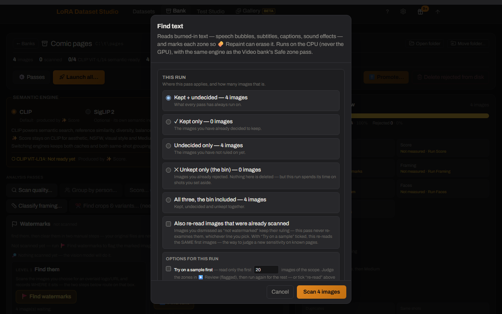
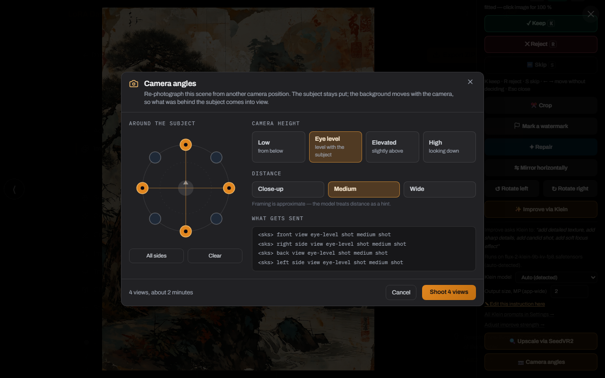
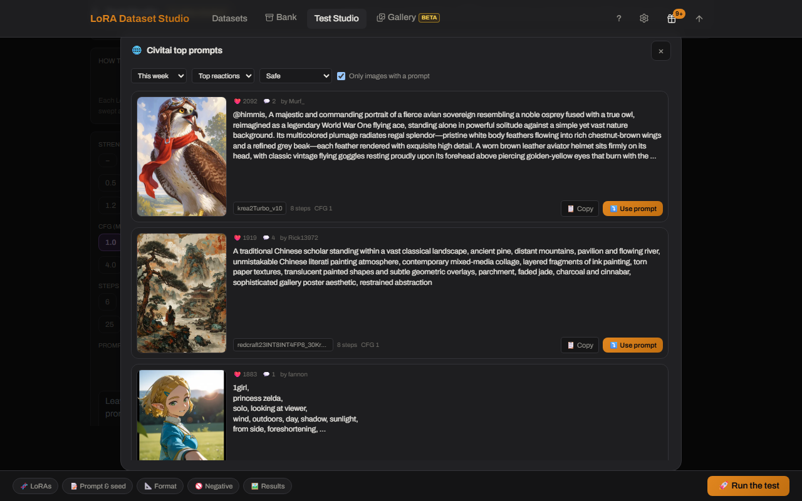

# Feature reference

[Documentation](../README.md) · [Task instructions](using-the-app.md) · [Plugins](../../README.md#plugins) · [Requirements](requirements.md)

Detailed capabilities, examples and limits. Optional features require the corresponding [public plugin](../../README.md#plugins); configure it under **Plugins → Settings**.

## Build any dataset

| Capability | What it provides |
|---|---|
| **Character / Concept / Style** | Kind-aware captioning, masking, readiness checks and training policies rather than three cosmetic labels |
| **Human / Animal / Creature / Object / Other / Anime subjects** | Subject-specific identity wording and shot catalogs; Anime protects the character design and illustrated rendering instead of forcing photorealism |
| **Five generation engines** | Nano Banana Pro (Gemini), ChatGPT (`gpt-image-2`), OpenRouter, or local Klein and Krea 2 Edit through ComfyUI |
| **Several engines in one batch** | Tick multiple engines and split one shot list across them; every result remains labelled with the engine that produced it |
| **Generation queue** | Generations, ✨ upscale batches and tile retries line up instead of blocking each other. A dock in the corner shows what the GPU is on and what is waiting, lets one job jump the queue or leave it, and says plainly when the whole queue is held by a training run |
| **Krea 2 Edit** | Restage a single reference while preserving identity, without needing a character LoRA first; the selected card controls output framing |
| **Variation catalog** | Balanced expression, angle, lighting, framing, outfit and background shots; import/export the catalog as JSON and keep custom entries |
| **Shot-type views** | Sort or group the grid by shot type to judge like against like (too many of these, not enough of those, which near-twins to keep), and ✏️ edit a custom shot card in place instead of deleting it and retyping the sentence |
| **Reference editing and exact retry** | Edit the main reference through any available engine, compare before/after, then retry with the exact prompt, engine and temporary references |
| **Import or scrape** | Drag in images, merge ZIP/folder datasets, search Reddit, Pexels or the open web by keyword, or scan a gallery/direct-media URL — a dozen sites have a dedicated handler that enumerates a profile or a gallery properly, several of them needing your own credentials entered once in **Settings → Source credentials**, and anything else goes through gallery-dl and whatever its bundled extractors cover. A site gallery-dl has no extractor for shows "No images found on this page" (the fallback item exists internally but is video-typed, so the image picker filters it out); a URL the app refuses outright — a retired source, a non-public host — says so as an error instead |

API generation follows each provider's billing and content policy. See [API image engines](../../bundled/api_engines/README.md) for Gemini, ChatGPT (including its experimental subscription connection) and OpenRouter, and [Pexels authorization](workflow.md#the-built-in-web-scraper) before using that source. The local engines do not send reference images to an API.

## Image Bank

A dataset is the thirty images you train on. A **bank** is the three thousand you had to look at to find them — and looking at three thousand images by hand is where most datasets die.

Point a bank at a folder, or scrape straight into one. It reads what is there **in place**: your files are never modified, moved or renamed, and the single action that does touch the source folder announces itself in capitals before it runs. Then **one pass measures the whole pile**, and every question afterwards is answered against those measurements instead of against your eyes — what is blurry, what is a duplicate of what, who is in it, how it is framed, whether it is a photograph or a render, and what it actually shows. You keep, reject and shortlist; a kept selection graduates into a dataset with its analysis attached, and can come back the other way.

The cuts are measured rather than guessed: the aesthetic and near-duplicate thresholds were calibrated on a real bank of **7,316 images**, and every measure that cannot answer says "unsure" or "not measured" instead of inventing a verdict. The image lane is out of Beta; the **video** lane still carries the chip, and says why below.

<table>
  <tr>
    <td width="62%" valign="top">
      
    </td>
    <td width="38%" valign="top">
      
    </td>
  </tr>
  <tr>
    <td valign="top"><strong>The workspace</strong> — every pass on the left, and on the right what the bank actually <em>is</em>: how much of it each pass has covered, its resolutions, framings, mediums, and how many duplicate and person groups are still unresolved. Every number here is measured, never assumed: a pass that has not run says so instead of showing a zero.</td>
    <td valign="top"><strong>Launch all</strong> — the whole triage in one go. Every flag quotes what it would reject <em>today</em>, and says out loud that 3,602 images have not been scanned yet, so those counts will grow. Stop it any time; a pass whose tool is missing is skipped, never failed.</td>
  </tr>
</table>

| Capability | What it provides |
|---|---|
| **Folder or web scrape → bank** | Inventory a live folder in place, or scrape into a new/existing bank without applying dataset filters on the way in |
| **One scoring pass, many answers** | A single pass produces aesthetic, NSFW and style rankings, groups, and embeddings every later feature reuses instead of re-inferring |
| **Quality and similarity passes** | Flag blur, noise, flat frames, small/soft-detail images and black bars; group duplicates, crops and recompressions — then, in a second pass, the near-duplicates only an embedding sees, with a per-run threshold and its own groups kept apart from the pixel ones |
| **Auto-reject by flag** | Turn any set of quality flags into a bulk rejection in one click, on the number it will really reject rather than the number flagged — and undo it as one decision |
| **People, framing and captions** | Cluster faces without a reference, classify face/bust/body/back, and caption the bank for full-text search — choosing the engine, the vision model and the pile per run, without changing your settings — kept + undecided by default, or kept, undecided, unkept (the bin) or all. Aiming a pass at the bin is never the default and states what it costs, and the button quotes the number it will actually write rather than the size of the pile. Every caption records **who wrote it** — the engine, or you — so once a pile is fully captioned, **Re-caption** redoes it with another model while keeping the ones you wrote or corrected by hand, unless you tick the box that rewrites those too. It counts the three cases before you click, including the captions written before the app tracked authorship: those cannot be told apart, and no undo covers captions |
| **Medium and head angle** | Split a mixed dump into photographs, anime, 3D renders and illustrations (reusing the scoring embeddings, no new inference), and filter by frontal / three-quarter / profile / back view. Both answer "unsure" or "not measured" instead of guessing, and both say so on screen: non-photo verdicts are rare by design, and profiles are under-counted because a hard-turned head often defeats face detection |
| **Find and shortlist** | Find by text, pick diverse, make framing-balanced picks, find similar images, or promote a shortlist into a new bank. You can also describe the set you want in a sentence and let the app set its own filters from it: the model reads the words only, never your images, so it moves the same chips you can edit and the counts beside them stay the measured ones. It says when a request has nowhere to land rather than inventing a filter, and it will not turn an exclusion into a search phrase, because the ranker returns more of a negated thing, not less |
| **Coverage advice** | A green readiness meter says the set is big enough; it does not say the set is varied. Coverage reads the labels, the scoring embeddings and the captions to name what the pool never shows — no profile views, one outfit, eye level only — because twenty-five versions of one photograph pass every other check. Advice only: nothing is kept or rejected, and what could not be measured says so instead of drawing an empty bar |
| **Fast review tools** | Filter, sort, review one by one, rotate without rewriting the source, compare an improved candidate with its original, and re-run only eligible passes |
| **Editable watermark masks** | Detect marks, redraw several mask zones, then crop or repaint into a separate clean derivative. Your source file is never written to: the clean copy lives beside it, and each level asks which pile it should run on (kept, undecided, unkept or all) before touching anything. Undo drops the clean copy and restores the original as the one in use, for the whole bank rather than a single run, and it skips any image whose source changed on disk since; an image already promoted into a dataset keeps the cleaned copy that went with it |
| **Crop and upscale in the bank** | Reframe a shot or re-render it at a higher resolution without leaving the bank — no promote-into-a-dataset-and-export-back detour. ✂ Crop is per image, in Review, and **resamples nothing**: a bank sits upstream of the training resolution, so the cut keeps its pixels and the dataset still decides the size when it imports. ✨ Upscale & improve is a scoped background pass on Klein or SeedVR2 — it needs ComfyUI and a GPU, spends minutes **per image**, and replaces what the bank shows rather than producing a candidate to validate. Your files are never written to: both land in a copy the app keeps, ↩ Revert throws it away and hands back any rotation the edit absorbed, and every measurement taken from the old pixels is cleared so the passes re-read the image you are keeping |
| **🔤 Find text** | Read burned-in lettering — speech bubbles, subtitles, captions, Latin or CJK alike — into the same mask funnel the watermark tools use, so 🧽 Repaint erases it and ✂ Auto-crop never touches a bubble. CPU-only, on the same small offline OCR the Video Bank uses; try it on a sample first and tune a stored sensitivity before committing a 9,000-page bank. Very stylised sound-effect lettering can still escape the reader — the mask editor covers those |
| **Dataset ↔ bank round trip** | Promote bank keepers into a dataset or copy dataset keepers into a bank while retaining compatible metadata and provenance |
| **Safe bulk work** | Undo the last bulk decision, tune thresholds where you work, move a bank without losing analysis, or run the full chain overnight |
| **The one destructive action** | Everything above leaves your files alone — 🗑 **Delete rejected** is the single bank action that touches the source folder. It sends the rejected files to the OS trash (or the app's own, or deletes them) behind a type-DELETE confirmation that first states how many files, where they go, and which other banks share that folder. It refuses outright when the folder is also a dataset's |

   
  <strong>🔤 Find text</strong> — burned-in lettering becomes mask zones the same 🧽 Repaint erases. In a bank's Watermarks panel (datasets carry it too); try a sample first, then commit the pile.

## Video Bank *(Beta — first release, read the limits)*

Turns long source videos into a **video training set**: a flat folder of `.mp4`
clips with matching `.txt` captions, cut to the exact frame count and frame rate
the target model accepts.

| Capability | What it provides |
|---|---|
| **Folder → video bank** | Point a bank at a folder of videos. It is referenced **in place**: no pass ever writes to it, exactly like the image bank. The one thing that adds to it is a scrape you send to that bank yourself |
| **Create a video dataset directly** | Choose **Video** in **New dataset**, then add local files or selected web videos in **Add videos**. Imports encode to the selected model, length and size, optionally split long sources, and report files that could not be imported |
| **Automatic shot detection** | Finds the cuts with TransNetV2, so a long file becomes individually reviewable shots instead of one blob |
| **Review without waiting** | The grid shows thumbnails; a click plays that shot from the source, so nothing is encoded before you have decided |
| **Target-aware cutting** | Pick the model you are building for and the clip length offers **only counts that model can actually ingest** — Wan wants 4n+1 frames, LTX 8n+1, MiniMax H3 five modulo seventeen, and none of them will tell you if you get it wrong |
| **Encode only what you keep** | Cutting a clip means re-encoding it, so that is paid once, at promotion, for the clips you kept. A bank of 400 shots you triage down to 120 encodes 120 files, not 400 |
| **Fix a bad cut instead of rejecting it** | Trim either bound (by 1 s or one frame *of your source*), split a shot at the playhead, or draw a shot the detector missed. Bounds only — there is no scrubbable timeline. For image-to-video targets the first frame is the conditioning image, so moving a start picks what the model animates from, and the panel says so |
| **Measure every shot, choose your own cuts** | One pass reads every frame and scores stillness, blur, black moments and frozen stretches. Flags mark shots to *look at* — nothing is auto-rejected — and there are **no default thresholds**: a preview shows how many shots each cut would flag against *your* bank's own distribution before you apply it |
| **Sound measured, not assumed** | For the targets that keep an audio track (LTX, MiniMax H3), every shot is scored for **how much of it is silence** and its **level in dBFS** — because a dataset of silent clips teaches the model to be silent and the file on disk gives nothing away. "No track", "silent" and "not measured yet" stay three different answers |
| **Cap one source's share** | Optional cap on how many clips a single file contributes, so a 50-clip set is not quietly three videos over-represented. Keeps each source's earliest clips (same bank, same dataset — not a random sample), and the result reports the share it ended up with |
| **Trim the transition off both ends** | Optional per-export trim of both bounds (0 by default). A clip the trim makes too short for the target's frame count is **dropped, never exported short** — and counted separately from clips that were never long enough, since only one of the two is fixed by lowering the trim |
| **Train it without leaving the app** | A promoted set gets a ▶ Train button that runs it through the ai-toolkit installed here — no export, no hand-written config. It queues behind the same GPU as everything else: a captioning pass, a ComfyUI render or an image training in flight refuses the launch instead of racing it |
| **Shots described in words** | A pass writes what HAPPENS in each shot ("a woman turns and walks away"), which becomes the clip's `.txt` — the prompt it trains on. Captions are drafts: editable per shot, and a re-run never overwrites what you wrote |
| **Spot the shot you already have** | A pass compares every shot to every other and groups the near-identical takes — ten copies of one gesture do not teach a model ten things. Each pile keeps its **sharpest** member unflagged, so you know which one to keep, and flagged shots can be selected and rejected in one gesture. It costs no GPU and no new decode: it reuses the frame vectors *Find a scene* already cached |
| **Spot the watermarked shots** | A logo burned into the same corner of every frame is the most consistent thing in a dataset, so it is the first thing a LoRA learns to draw — and it is invisible at thumbnail size. An optional pass runs the same detector the image bank uses over each shot's sharpest frame and flags what it finds. Needs the watermark detector from Setup; a shot it could not judge is counted apart and reported as one it **could not judge**, never folded into the clean ones |
| **See the bands and the subtitles before the model does** | A subtitle sits in the same rectangle of every frame of every clip from one source, so a LoRA learns it early and then draws letter-shaped gibberish there forever; letterbox bars survive a training crop. An optional pass measures both on three frames of each shot — flat bands on all four sides, and text that HOLDS STILL across those frames, so a shop sign in a pan is left alone as scene content — then reports the rectangle a crop would leave you and how much of the frame that is. Three cuts read it, all empty by default. Reading text needs one small CPU package from Setup; **without it the pass still measures the bands and says so**, rather than reporting a bank with no text in it |
| **Catch the encoding damage the eye misses at thumbnail size** | One ffmpeg sweep per file measures three things the existing metrics are blind to: **duplicated frames** (12 fps anime padded to 24, pulldown — every average stays healthy, the model still trains on each picture twice), **compression blocking** (the macroblock grid of a starved re-encode, measured directly instead of guessed from the bitrate), and **edge blur at full resolution** — which is what an **upscale** looks like, and the sharpness score computes on a 160 px copy where a 480p upscale and a native 1080p are literally the same image. Three cuts, empty by default; the file cards also show each source's codec profile and bits-per-pixel |
| **Find a scene by typing a word** | One pass looks at a few frames of every shot; after it, typing *a woman walking on a beach* ranks the bank instantly and tells you **which second** of each shot matched. Several frames per shot, so a subject that only appears at the end is still findable. It is a **ranking, not a filter** — every shot scores something against every phrase — and the model **ignores "without"**, so `-word` pushes something down instead |
| **Triage one keystroke per shot** | ⌨ Burst mode above the gallery puts a cursor on one tile: K keeps, R rejects, P puts it back to untriaged, S or → moves on without deciding, ← steps back. Same keys as the image bank, nothing auto-decided |
| **Sort shots by what the camera did** | A 🎥 Camera pass tracks every frame of every shot and labels the move (pan, tilt, push-in, pull-out, handheld, locked off…), so a bank of a thousand shots can answer "which of these are static" and the clip's caption can say it |
| **Find the shots that are secretly two shots** | A pass flags the soft cuts detection misses (a dissolve, a match cut, a new angle in the same room) so a "shot" that is really two scenes gets reviewed instead of teaching the model a transition nobody asked for |
| **See which shots may be generated rather than filmed** | A CPU-only 🤖 AI check flags clips whose motion is too regular to have been filmed (a generated clip passes every other check at thumbnail size). A flag to look at, never an auto-reject; not yet calibrated against a large set of known generated clips |

**What it does NOT do yet**, plainly:

- **"Most varied" selection is still to come.** Shots do carry a look score now
  (the same LAION aesthetic scale as the image bank, read off the vectors 🔎
  Find scenes already caches) — but diversity-aware picking is not built yet.
  Searching by words ranks shots by what they LOOK like, which is a different
  question from whether they are any good.
- **Near-duplicates are found, but the threshold is inherited, not measured on
  video.** ✂ Duplicates groups shots at a cosine cut carried over from the image
  bank's own calibration over the same CLIP space; no video-pair calibration
  exists yet. It also compares two shots at their *closest* pair of frames, which
  reaches any given cut more easily than a single-image comparison — so on a bank
  of similar-looking material, expect to raise it.
- **No audio captioning, and no audio in the search.** The sound is measured
  (silence and level) but never described, and 🔎 Find scenes reads frames only —
  "a door slamming" describes nothing it can see.
- **Captioning is per-shot prose, not tags.** Every promoted clip gets a `.txt`:
  its caption when it has one, and an **empty** file when it does not. The file is
  always written, because a missing one crashes one trainer and makes another drop
  the clip silently — and an empty one trains uncaptioned, which is why the build
  dialog counts them out loud before encoding.
- **Training starts here, but only one target is proven here.** A promoted set
  has a **▶ Train this dataset** button that hands the clips to the ai-toolkit
  installed on your machine. The eight offered targets (Wan 2.1 T2V and I2V, Wan
  2.2 T2V and I2V A14B, Wan 2.2 TI2V-5B, LTX-2 and 2.3, MiniMax H3) are exactly
  the video architectures that ai-toolkit ships, and each one's settings were
  read in its code — plus a "Generic / other" escape hatch that imposes no frame
  rule at all. But **Wan 2.2 14B is the only one a finished run has been through
  here**, and the card says so on the others. Measured on that run: 24 GB was
  full, at 170-185 s per step, with the CPU offload that makes 24 GB possible at
  all. Only three bases are stated by anything installed locally, so **five of
  the eight need you to name a base repository** — both I2V Wan variants, Wan
  2.2 TI2V-5B, and both LTX-2 versions. Wan 2.2 **A14B** saves each checkpoint
  as a **pair** (high-noise and low-noise experts) — the 5B does not — and both
  files are offered together, because either one alone is a LoRA nothing can
  load.
- **MiniMax H3 needs about 43 GB of weights, and will say so rather than fetch
  them.** They come from `Comfy-Org/MiniMax-H3`. If they are not on your disk the
  button names the repository and the size and waits for a yes — a first run that
  quietly downloaded 43 GB would look like a training that had hung.
- **MiniMax H3 is licence-restricted.** Its community licence grants no rights in
  the EU, the UK, South Korea or the USA, and the restriction covers the model's
  outputs, not only the model. Check your own territory before using that profile.

## Curate, caption and clean

| Capability | What it provides |
|---|---|
| **Curation grid** | Keep/reject, crop, mirror, rotate, zoom, resize, multi-select and non-destructive upscale candidates from either engine — Klein re-renders detail (sharper, but skin and colour can shift), SeedVR2 resolves detail and leaves the original look alone |
| **Identity and composition checks** | InsightFace similarity, score-based auto-triage, framing badges and a live Character composition meter |
| **Model-matched captions** | Prose or booru form selected by target family, with kind-aware Concept leak checks and content-only Style rules |
| **Appearance policy** | On a character dataset, choose per trait whether captions *omit* or *describe* hair, makeup and nails, facial hair, and glasses, so what stays unnamed binds to the trigger on purpose (face, eyes, skin, age, gender and ethnicity stay omitted); changing the policy offers a targeted re-caption |
| **Caption Lab and recovery** | Find/replace, tag frequencies, expanded editing, targeted re-captioning, stoppable batches and reload-proof recovery |
| **External caption round trip** | Export ordinary image/`.txt` pairs, caption them in any tool, then re-import without duplicating images or overwriting non-empty LDS captions |
| **Dual long + short captions** | ai-toolkit text-side augmentation for supported local families; both wordings remain editable per image |
| **Watermark review** | Detect, review and edit masks; choose crop, LaMa inpaint or a Klein whole-photo re-render (found zones erased first); every edit keeps an `.orig` backup and **Restore original** supports another attempt. 🔤 Find text feeds the same funnel with burned-in lettering (speech bubbles, subtitles), on datasets as on banks |

## Train, compare and continue

LDS uses ai-toolkit as its training engine. For unsupported architectures or experimental configuration keys, use ai-toolkit directly; standard image/`.txt` exports keep the workflows interoperable.

| Capability | What it provides |
|---|---|
| **Guided local training** | ai-toolkit underneath, family-scoped starters, adaptive step policies, launch guards, queueing and advanced controls |
| **Slider LoRA (Beta)** | Train a bipolar conceptual slider from positive and negative prompt poles, so LoRA strength moves the learned trait in either direction and Test Studio can sweep both sides |
| **Merge a LoRA into a checkpoint** | Fold one or more of your LoRAs into a base, each at its own weight, and get a complete model you can publish. A plan answers first, from the file headers alone: how many tensors change, how big the output is, which drive it lands on, how long it takes, and what a half-way failure leaves. What comes out is a **merged** model, not a trained one — the file's own metadata records the base, every LoRA and its weight, so it stays true after a rename |
| **Custom bases and continuation** | Train compatible custom weights, continue from any saved epoch, or use verified full-state resume where available |
| **Runs** | Local training runs with progress, logs, stop/retry/continue/download actions and paste-safe config sharing |
| **Experiment lineage** | Inspect, annotate and diff the exact tree of runs and the checkpoint each continuation resumed from |
| **LoRA Canvas** | Put every dataset's lineage on one pan/zoom board, rearrange cards, compare runs across datasets, generate from same-family checkpoints — including 🧬 blending several checkpoints into one image, with purple provenance edges joining a blended picture to every pill it came from (blends made before this feature show a badge instead) — pin/fuse outputs and continue training from a pill; each generation run keeps its own strip in training-step order, with the character dataset's reference face on its lane. A 🔌 + LoRA button pins any LoRA from your ComfyUI folder onto the board as its own plugin node, with its own strength — it stacks onto a run anchored by a checkpoint trained here, not as a solo generation on its own. ⏏ **Undeploy** lists every LoRA the app has put into ComfyUI, across all datasets and families, and removes the ones you tick in one pass — only what the app deployed is listed, so LoRAs you downloaded yourself are never shown or touched, and the training saves are kept so anything removed can be deployed again |
| **Test Studio** | Fixed-seed checkpoint × strength grids, multi-LoRA comparisons or 🧬 combined stacks (several of your LoRAs in one image, each at its own weight, weight variants compared side by side), a ✨ Enhance button that enriches your prompt through your local LLM, votes, Wilson ranking, face ranking and shareable exports |
| **📝 Prompt batch** | Tick several prompts — from the saved history, from 🎬 Scenes or from the 🌐 Civitai browser — and one launch renders them all: one image set per prompt, same checkpoints, same settings, same seed. The cost counter multiplies by the batch before you click, not after. On every launch surface, the multi-LoRA comparison included |
| **🎬 Scenes** | Run a bank's or a dataset's captions in their order as one batch of prompt passes (a storyboard, a shoot, a chapter page by page), each shown with the image it came from, in the Test Studio and the board's 🎨 Generate; the 🎲 shortcut still draws one caption at random |
| **🖼 Gallery** | One feed of every image the app ever generated — Test Studio cells, Canvas previews, comparison runs and ✨ improvements — across every dataset, newest first, with dataset / renders-vs-improved / 👍 liked filters. The viewer walks the feed with the arrow keys and shows everything a picture was made from; ⬇ downloads keep the lineage name, ✨ Upscale & improve runs straight from the feed (the result lands at its top), and a Select mode deletes misses or ZIPs a pick. The feed loads itself as you scroll, on a phone as well as a desktop |
| **📷 Camera angles** | Re-photograph a generated image (Gallery viewer) or a kept dataset image from other camera positions — pick azimuths on a dial plus a camera height and a distance, read the exact prompts and the cost before you shoot, cancel any view from the queue. Runs locally on Qwen-Image-Edit with a Multiple-Angles LoRA through ComfyUI; Setup installs the whole stack from one card. On a dataset image the angle is written into the caption at birth ("seen from behind, low camera angle") and re-injected on every later captioning pass, because an angle left undescribed binds to the trigger word. New views land as pending candidates of the normal keep/reject cycle. The Bank stays out on purpose — it is the reservoir of real photos; promote first, then re-shoot |
| **🌐 Civitai top prompts** | Browse Civitai's most-reacted images of the day, week, month, year or all time, each shown next to the generation prompt it was posted with, and reuse one in a click — or tick several and render them all in one run, one image set per prompt on the same seed and settings, which is what makes them comparable. The same button on the dataset Test Studio, the multi-LoRA comparison and the board's 🎨 Generate. Not every image publishes its prompt (the browser keeps the ones that do by default), and reading prompts needs the free Civitai API key from Settings → Scraping & sources — the same single key the scraper uses. The content-level select is a ceiling, Safe by default |
| **🎬 Video Test Studio** | The same question as the image Studio, asked of a video LoRA: one clip per start frame, same seed and same prompt, so the clips differ by their picture and nothing else. Pick several start frames at once — files, bank tiles, Gallery images or a training clip — and one click queues one clip each. Every dial says what it costs (turbo, sparse attention, latent upscale, sampling steps), clips run to 15 seconds, and the history keeps the prompt in the engine's own format with every setting that ran and the time it took. From a finished clip: ↻ Reuse its settings, ≈ Smooth to twice the frame rate, ✨ Neural to re-render it |
| **✨ DLSS 5 Neural Rendering** | Re-render a finished clip through NVIDIA's DLSS 5 model — skin, hair and fabric gain structure the source only implied. In a dataset the render replaces the clip and the original is kept (Restore); in the studio it is a new clip beside the old one. **⇔ Compare** plays both side by side, in step, with a 1:1 zoom, because a neural render is judged in motion and not on a still. Strength, passes and a 2× working size push it past the model's default. Windows + NVIDIA only: Setup installs the bridge, you bring the model file — the app never downloads it and says so |
| **Studio shortcuts and recovery** | Open Studio directly from a run, draw prompts from kept dataset captions, and pause safely when ComfyUI drops instead of launching later cells against changed state |

<table>
  <tr>
    <td width="50%" valign="top">
      
    </td>
    <td width="50%" valign="top">
      
    </td>
  </tr>
  <tr>
    <td valign="top"><strong>📷 Camera angles</strong> — pick positions on the dial, read the exact prompts and the cost <em>before</em> you shoot. Lives in the Gallery viewer and on every kept dataset image.</td>
    <td valign="top"><strong>🌐 Civitai top prompts</strong> — the most-reacted images next to the prompt they were posted with; ⤵ drops one into your prompt field, ☐ Batch collects several for one run. Next to the prompt box on every generation surface.</td>
  </tr>
  <tr>
    <td width="50%" valign="top">
      
    </td>
    <td width="50%" valign="top">
      
    </td>
  </tr>
  <tr>
    <td valign="top"><strong>✨ DLSS 5 Neural Rendering</strong> — ⇔ Compare plays the original and the render together, in step, at 1:1. A neural render is judged in motion, not on a still.</td>
    <td valign="top"><strong>🎬 Video Test Studio</strong> — every clip keeps the prompt, the dials that produced it and what it cost; ↻ Reuse, ≈ Smooth, ✨ Neural and ⇔ Compare start from there.</td>
  </tr>
</table>

## Keep control of the files

| Capability | What it provides |
|---|---|
| **Training ZIP and sidecars** | Standard kept image + same-stem `.txt` pairs for ai-toolkit/Kohya-compatible tools |
| **Portable backup and restore** | Datasets, decisions, captions, settings and run history in one file; API keys stay out |
| **Hugging Face publishing** | Publish kept pairs to a dataset repository, private by default and gated by an explicit rights confirmation |
| **Publish to Civitai** | Push a trained checkpoint and the images you pick to a Civitai model page without leaving the app — the page, the version and the pictures in one dialog. It is left as a **draft** so nothing goes public until you have read it back on Civitai. Uses the same free API key the prompt browser and the scraper already share |
| **ComfyUI deployment** | Deploy individual LoRA checkpoints into the configured LoRA tree, hard-linked when it sits on the same drive so it costs no second copy |
| **Recoverable deletion** | Deleted app data goes to Trash; destructive Image Bank actions state their destination before confirmation |
| **Storage you can see and move** | Settings › Storage lists every folder the app writes to with its path and (on request) its size, and can point the dataset root and the checkpoint store at another drive — moving what is already there, or adopting the new folder empty, never silently. Trained checkpoints live in their own store that no cleanup touches; the trash sits on the same disk, so space returns only when you empty it. The same tab shrinks any full-precision `.safetensors` on this machine to the ~10 GB fp8 file ComfyUI loads. |

## A quick visual tour

<table>
  <tr>
    <td align="center" width="50%">
       
      <strong>Image Bank</strong> — score, search and shortlist large collections.
    </td>
    <td align="center" width="50%">
       
      <strong>Curate</strong> — review, repair and balance the training set.
    </td>
  </tr>
  <tr>
    <td align="center" width="50%">
       
      <strong>Runs</strong> — follow local and cloud experiments together.
    </td>
    <td align="center" width="50%">
       
      <strong>Test Studio</strong> — compare checkpoints at fixed seeds and strengths.
    </td>
  </tr>
</table>

   
  <strong>LoRA Canvas</strong> — every run on one board, and the exact recipe behind each one.

The detailed journey, screenshots and operational notes now live in the [workflow guide](workflow.md).
