# End-to-end workflow

[← Documentation index](../README.md) · [Install first](../../README.md#setup--install) · [Task-level guide](using-the-app.md)

This is the long-form route from an empty dataset to an exported LoRA. The root README keeps only the compact capability tables; this guide carries the screenshots, decisions and stage-by-stage detail.

| Stop | Outcome |
|---|---|
| [1. Decide what you are teaching](#1-decide-what-you-are-teaching) | Dataset kind, subject type, trigger and target family are defined |
| [2. Fill it with images](#2-fill-it-with-images) | References, imports, scrapes or Image Bank keepers enter the dataset |
| [3. Curate down to the keepers](#3-curate-down-to-the-keepers) | Off-identity, weak and redundant shots are removed |
| [4. Caption for the model](#4-caption-for-the-model) | Every kept image has family- and kind-appropriate wording |
| [5. Scrub watermarks](#5-scrub-watermarks) | Marks are reviewed and removed without losing originals |
| [6. Train](#6-train--guided-advanced-when-you-need-it) | A guarded local run produces checkpoints |
| [7. Read the family tree](#7-read-the-family-tree) | Runs, continuations, settings and previews remain traceable |
| [8. Pick the best checkpoint](#8-pick-the-best-checkpoint) | Fixed-seed comparisons identify the useful checkpoint and strength |
| [9. Take it with you](#9-take-it-with-you) | The dataset, LoRA and history leave in standard or portable formats |

## 1. Decide what you are teaching

Create a dataset as **Character**, **Concept** or **Style**. This choice changes real downstream behavior:

| Kind | Trigger and captions | Masks and training policy |
|---|---|---|
| **Character** | Uses an activation trigger; captions keep changeable details promptable while the identity stays implicit | Person masks are available; the composition meter tracks face/bust/body/back variety |
| **Concept** | Uses a trigger; captions describe everything except the concept and the leak check catches its accidental return | Person masks are off; optional face masks can reduce identity learning |
| **Style** | No trigger; captions describe content while leaving the aesthetic unspoken | Person masks are off and Style-specific readiness checks catch weak or repeated captions |

A Character also has a **subject type**: Human, Animal, Creature, Object, Other or Anime. The choice swaps both the shot catalog and identity lock. Anime protects the design, outfit, distinctive marks and illustrated rendering; it explicitly avoids turning the subject into a photograph.

You can change dataset kind later in **Dataset settings**. The confirmation explains which rules change and does not delete images.

  

## 2. Fill it with images

Sources mix freely inside one dataset:

| Source | When to use it |
|---|---|
| **Generate from references** | Build a Character set from one primary reference and optional extra angles |
| **Import** | Bring your own JPEG, PNG, WebP or BMP images; Character can auto-crop while Concept/Style preserve the frame |
| **Scrape** | Select permitted material from Reddit, Pexels or supported gallery/direct-media URLs |
| **Image Bank** | Triage a large unsorted folder or scrape before promoting a smaller set |

### Generate from references

This fork generates exclusively on **local** engines, both running through your own ComfyUI — free, private, NSFW-capable, no API key and no account. There are two:

- **Klein**, the historical engine. It reads the dataset's extra reference angles to strengthen identity.
- **Krea 2 Edit**, which re-stages a single reference photo while holding identity from that one photo alone — no character LoRA needed. It uses the primary reference and the selected card's framing.

*(Upstream also offers three cloud API lanes here — Nano Banana Pro through Gemini, ChatGPT through `gpt-image-2`, and OpenRouter — with their own provider-limit notes about SynthID, filtering and billing. This fork carries none of that: no engine API keys, no subscription login, no provider to depend on. See Divergence 1 in FORK_NOTES.md.)*

The variation catalog fans out expression, angle, lighting, framing, outfit and background. Each subject type has its own catalog, catalogs import/export as JSON, and a one-off custom shot can be kept permanently.

You can tick both engines for one batch. **Split across engines** sends each shot to a single engine, so the batch costs what one engine would cost but the dataset gains variety; **All engines** renders every shot on every engine for a side-by-side comparison, and doubles the cost accordingly. The same panel imports real photos, opens the scraper and pulls keepers out of an Image Bank.

Every generated tile reopens the exact prompt used to make it. The separate reference editor also supports **Retry**, which repeats the exact prompt, engine and temporary references of that candidate; choose **Try another prompt** only when changing the instruction.

### The Image Bank

The **Bank** tab inventories a live folder in place, or scrapes into a new/existing bank. It can quality-scan, score, group duplicates/crops/people/styles, caption, search, sort, rotate, review, build diverse or framing-balanced shortlists, edit watermark masks, and promote keepers.

The two directions are explicit copies:

- **Bank → dataset** promotes keepers through the normal import path and carries compatible captions, decisions and provenance.
- **Dataset → bank** creates a bank from dataset keepers without making the original files share ownership.

Nothing in a source folder is removed unless you explicitly choose **Delete rejected**. Watermark cleaning writes a separate derivative. The [task-level Image Bank guide](using-the-app.md#the-image-bank-triage-a-big-folder) covers shortlist banks, sorts, re-runs, comparisons, folder moves and the full metadata round trip.

  

**Launch all** chains the passes you tick into one unattended run, in a fixed order. A pass whose tool is not installed is announced as *will skip* before you start and never fails the run, and the dialog lists exactly what is about to execute.

  

### The built-in web scraper

The scraper's **Reddit | Pexels | URL** switch keeps each source separate. It de-duplicates near-identical results, blocks internal/loopback URLs, hides dead media, and applies dataset quality filters when importing directly into a dataset. Scraping into a bank intentionally stores first and lets the bank's own passes decide later.

Credentials live in **Settings → Scraping & sources**. A personal Reddit client ID avoids the shared public quota. Pexels always requires an API key and uses its official API.

> **Pexels authorization required:** an API key alone does not authorize dataset or machine-learning use. Configure this source only if Pexels has explicitly authorized the use case. Read the [official Pexels terms and conditions](https://help.pexels.com/hc/en-us/articles/900005880463-What-are-the-Terms-and-Conditions); the app requires a locally stored confirmation before a Pexels query can run.

The scraper can reach adult sources. Use only material you have the right and consent to train on; see [Legal & responsible use](../../README.md#legal--responsible-use).

  

## 3. Curate down to the keepers

The curation grid is built for decisions rather than file browsing:

- keep, reject or undecide one or many images;
- crop, mirror, rotate, zoom or resize without leaving the workspace;
- score Character identity against the primary reference with InsightFace;
- apply score-based auto-triage while preserving later manual decisions;
- classify face/bust/body/back and fill the live composition meter;
- create a separate Klein improvement candidate, compare it with the original, then keep the better one.

Long captioning, face, framing and watermark jobs are server-side and reconnect after a page reload.

  

The **Curation** step itself holds the passes that run over the whole set rather than one image: face resemblance against the reference, and watermark find & clean.

  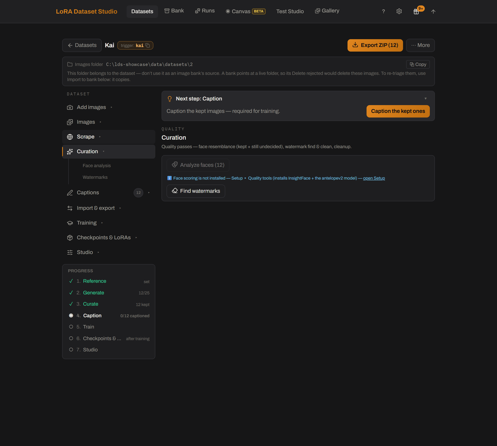

Each tile carries its own actions on hover — regenerate the variation with a new seed, edit the prompt before regenerating, crop, mirror, rotate or delete.

  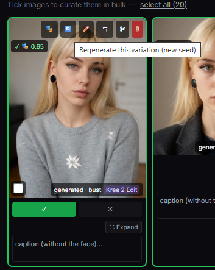

  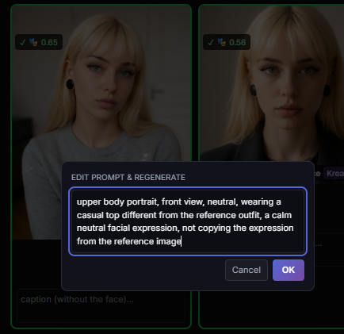

Clicking a tile opens it full size with the same actions plus **Review improvement first**, so a candidate is judged before it replaces anything.

  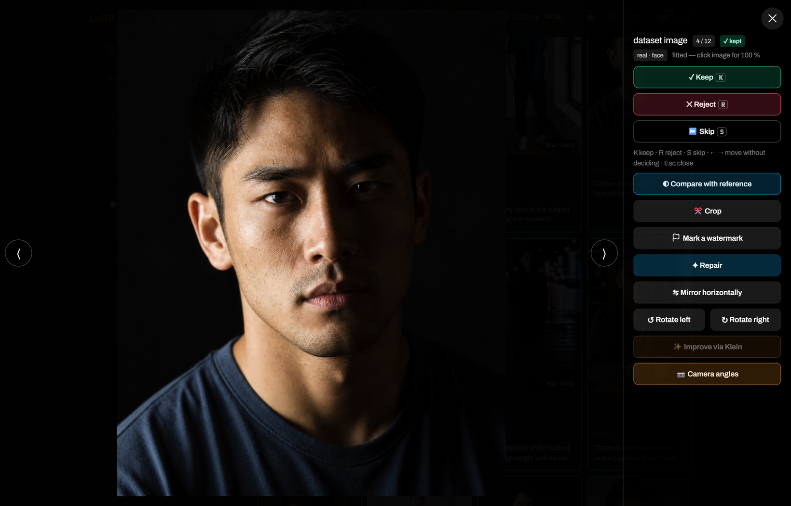

An upscale candidate is always shown against its original at the same scale. Klein re-renders detail — sharper, but skin and colour can shift, as the comparison below shows — while SeedVR2 resolves detail and leaves the look alone. Neither touches the original until you keep the candidate.

  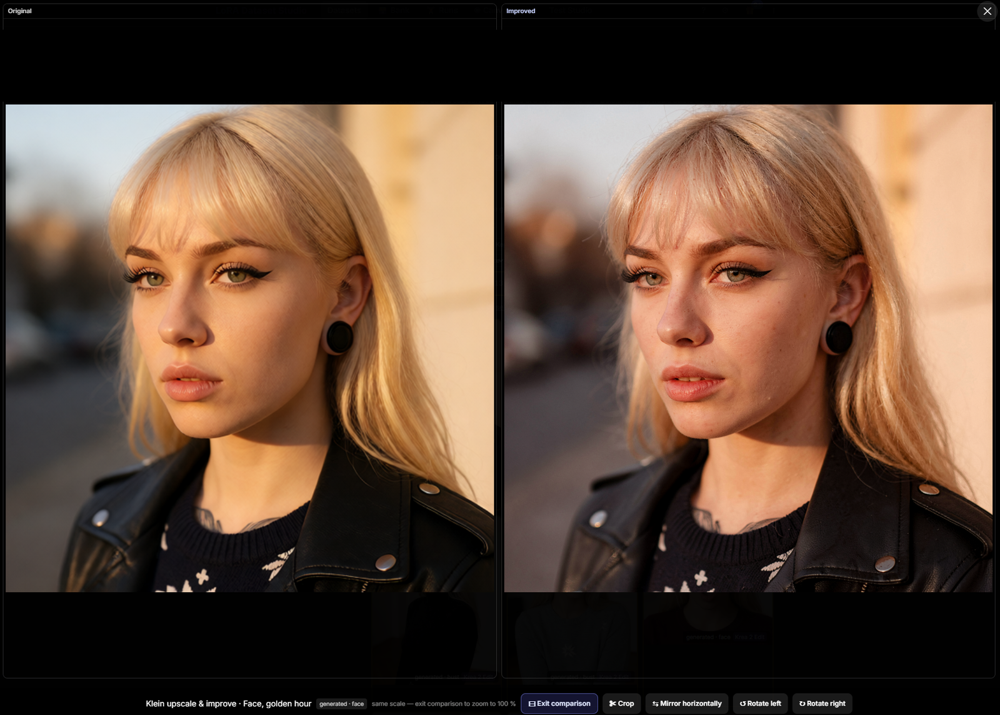

## 4. Caption for the model

Captions are the text the trainer actually reads. The target family selects the broad form (prose or booru tags), while the dataset kind decides what must stay implicit.

| Tool | Purpose |
|---|---|
| **JoyCaption / Ollama vision** | Generate captions with the engine selected for this dataset |
| **Vocabulary and wording options** | Choose Explicit, Clinical or Safe vocabulary and add project-specific instructions |
| **Caption length** | Aim the captioner at Concise (about one short sentence), Standard or Detailed — a target it follows loosely, not a word cap |
| **Identity/concept leak checks** | Catch text that accidentally describes the invariant meant to bind to the trigger |
| **Caption Lab** | Inspect frequencies, find/replace, isolate tags, edit in a larger panel and target only problematic images |
| **Long + short captions** | Train supported local families on two editable wordings through ai-toolkit's native text-side augmentation |

Caption batches are stoppable and reload-proof: completed text stays saved, and reopening the page reconnects to a running server-side job.

External captioners also work as a round trip:

1. Export the kept set as ordinary image + same-stem `.txt` pairs.
2. Caption with any tool that preserves those sidecars.
3. Re-import the ZIP or folder. Existing images are matched instead of duplicated, and non-empty LDS captions are never overwritten silently.

See [Caption your images in another tool](using-the-app.md#caption-your-images-in-another-tool) for the exact conflict rules.

  

Vocabulary, length and free instructions are three independent dials on the same prompt, applied in that order — the free instructions come last, so they override a preset they contradict. The length preset is a target, not a cap: Concise asks for a single short sentence in prose (never a tag list, so the dataset still reads as prose at training launch), Detailed for several sentences. It is also unrelated to the long + short dual captions, whose short half is derived from the long one and stored separately; both can be on at once. The image bank's caption pass offers the same two dials per run.

A running batch reports its position, can be stopped at any point, and shows the identity-leak scan result as captions land.

  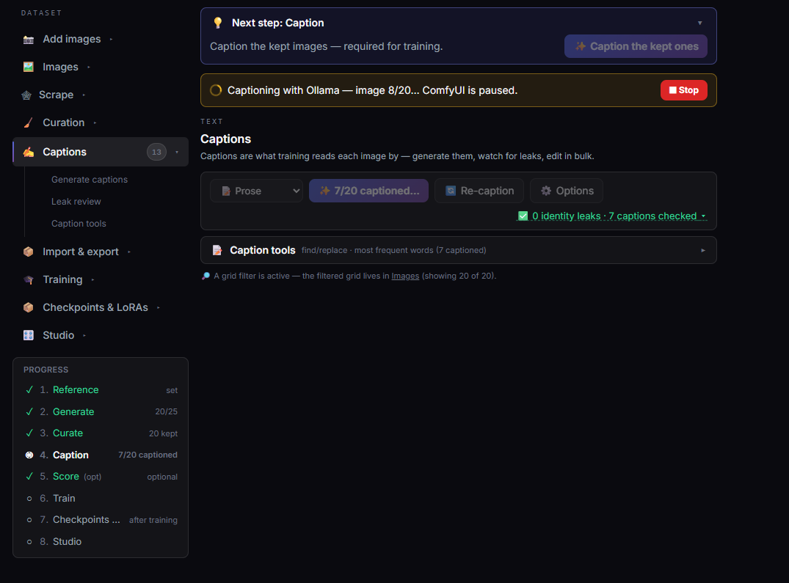

**Caption Lab** tries up to four caption configurations on one image and shows them next to the current caption, so an engine, vocabulary and vision model can be compared before either keeping one wording or making the configuration the dataset default. Nothing is saved until you pick.

  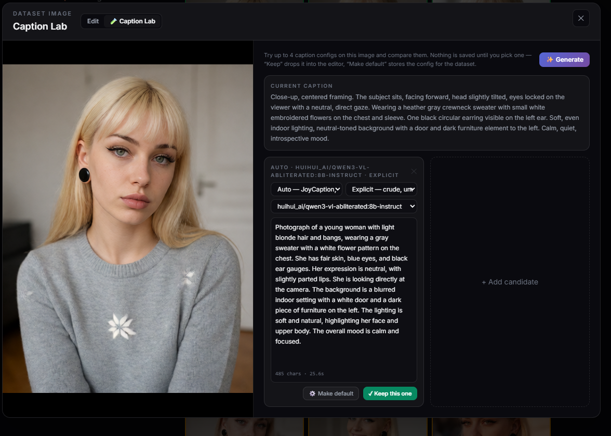

## 5. Scrub watermarks

A logo or URL left in the dataset can become something the LoRA learns. The workflow is deliberately **Find → Review → Clean**:

1. A local vision pass proposes watermark boxes but deletes nothing.
2. Review each flag. Move/resize the proposed zone or draw several missing zones.
3. Choose a model-free border crop or an inpaint lane: LaMa for speed, Klein for a refined local result.
4. Keep or reject the result. **Restore original** returns to the sibling `.orig` backup so another mask or engine can be tried.

The Klein lane pre-fills with LaMa, refines through ComfyUI, then composites the edited area back in pixel space. Everything outside the mask stays untouched.

  

## 6. Train — guided, advanced when you need it

[ai-toolkit](https://github.com/ostris/ai-toolkit) is the local training engine. The guided panel builds its config, applies family/kind rules and runs the final readiness check; raw config control remains available by using ai-toolkit directly.

The standard launch covers:

- family-scoped starters and adaptive steps;
- image, caption, duplicate, disk, VRAM, base and compatibility checks;
- rank/alpha, resolution, LoRA or LoKr, dropout, timestep weighting, optimizer, scheduler, EMA and save/sample cadence;
- masked Character training and optional Concept face masks;
- queued local jobs and a protected stop action;
- custom compatible base weights and checkpoint continuation.

Readiness messages distinguish a quality warning you may explicitly accept from a real impossibility. A queued run is revalidated again when it actually starts.

  

**Advanced options** exposes the levers behind the starter — base and variant, rank, resolution, save and preview cadence — and every one of them carries the *why* and the *how* inline instead of a bare label.

  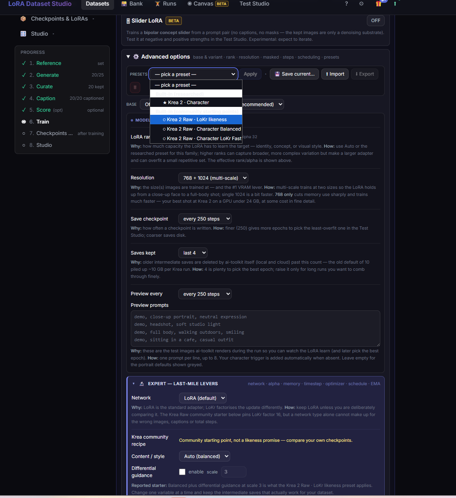

Below them, **Expert — last-mile levers** holds what should only move one variable at a time: network type, EMA, dual captions, face masking, memory saving, alpha, dropout, timestep weighting and optimizer. The memory-saving block reads the detected card and states what it costs to switch the options off.

  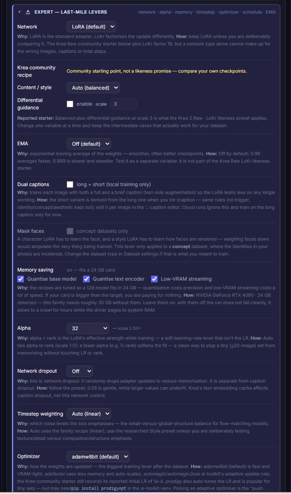

The final check runs before the launch, not during it. Near-duplicate pairs are shown side by side with a per-image **Reject this**, because repeated content is what the model overfits — and **Start anyway** stays available once you have seen what you are accepting.

  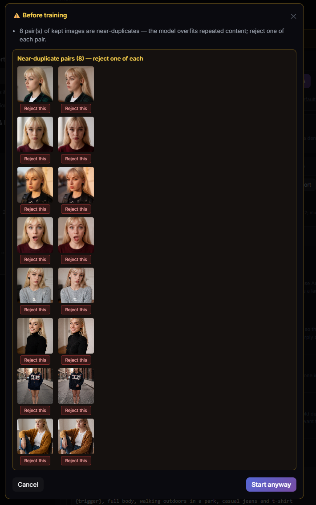

### No GPU? Then no training here

Training runs on this machine's own GPU. **This fork has no rented-GPU lane** — upstream ships one, and it is removed here on purpose. Everything before training works with no GPU at all, and **Settings → Devices** can send generation and the Image Bank's analysis passes to another machine on your network, but a training run is always launched on the Primary's own card.

If this machine has no suitable card, train the LoRA elsewhere and bring the `.safetensors` back: the Test Studio, the Canvas and every export lane work on a checkpoint this app did not produce.

### The Runs hub

**Runs** places every training job together with its stage, progress, ETA, logs, samples, exact recipe, stop/retry/continue/download actions and a paste-safe **Share config** summary. A run can open its dataset's Test Studio directly.

  

## 7. Read the family tree

Every continuation records the exact checkpoint it resumed from. The per-dataset lineage graph exposes:

- list and graph views;
- saved epochs as checkpoint pills;
- exact run settings, notes and side-by-side config diffs;
- same-prompt/same-seed checkpoint previews;
- download, deploy and continue-from-here actions;
- honest reconstruction of older runs, with missing files marked rather than invented.

  

Clicking a checkpoint pill opens its actions on the board — download that exact
epoch, or resume training from it — without leaving the graph.

  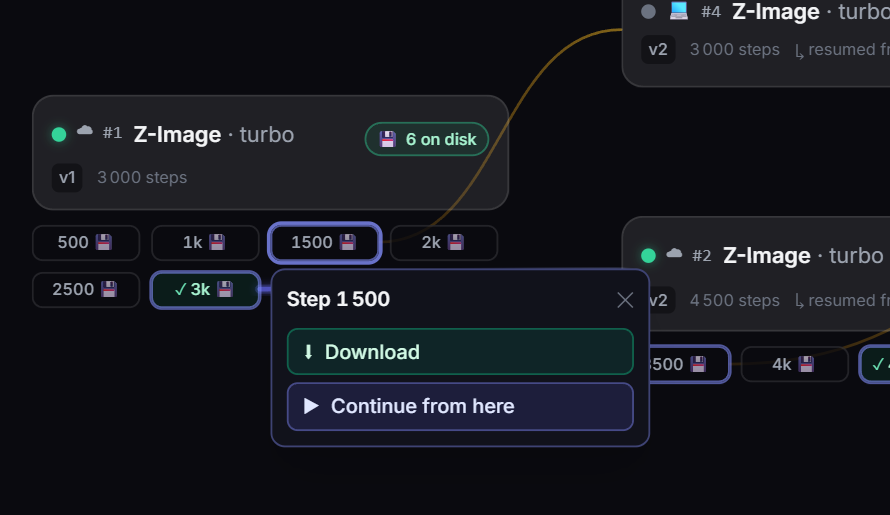

Clicking a run card opens its recipe: rank, alpha, learning rate, optimizer,
timestep weighting, network type and EMA, as they were frozen at launch.

  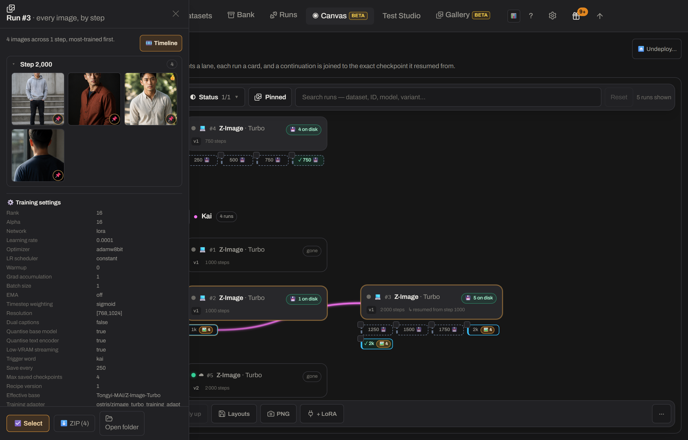

Shift-click two runs and the compare drawer answers "what did I change between
v2 and v3" — differing settings highlighted, identical ones folded away.

  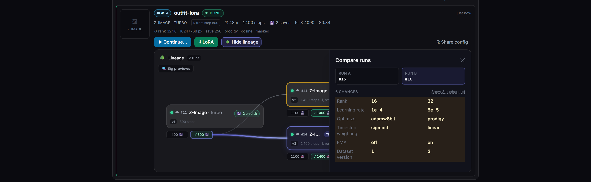

**🔍 Big previews** blows the same-prompt/same-seed thumbnails up into a grid on
the board itself, so several epochs can be judged side by side before picking one.

  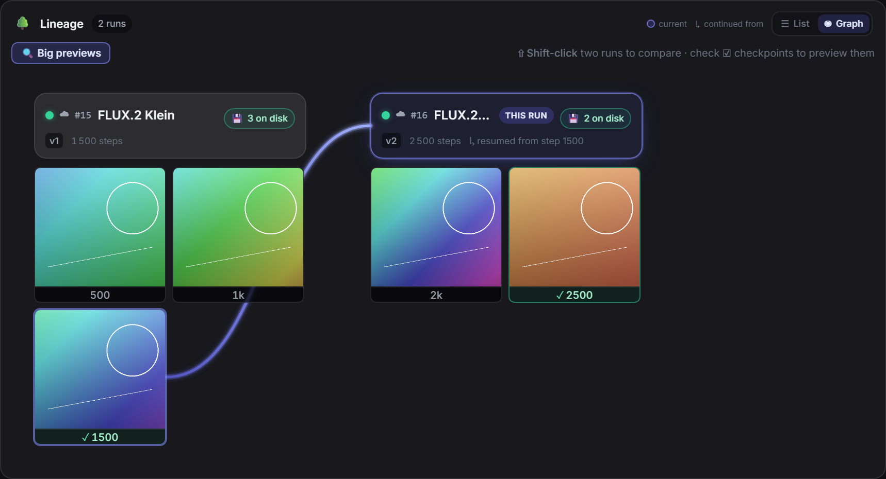

The separate **LoRA Canvas** puts every dataset's lineage on one pan/zoom board. It adds persistent card placement, cross-dataset run diffs, same-family checkpoint generation on one prompt/seed, galleries, movable/resizable pinned images, side-by-side fused image strips, bulk pinning and continuation from a checkpoint. A checkpoint not yet deployed is copied only after the launch button says so; mixed model families are refused before generation.

Clicking a run there opens the same inspector as the per-dataset graph: the frozen recipe of that run, its notes, and — in its own section — the deletion that takes the checkpoints and generated images with it.

  

The detailed board controls are in [The LoRA Canvas](using-the-app.md#the-lora-canvas-every-run-on-one-board).

## 8. Pick the best checkpoint

A trained LoRA is not automatically a good LoRA. Test Studio compares checkpoint/LoRA × strength under a fixed seed:

- sweep positive, over-cooked and slider-negative strengths;
- compare several LoRAs from the same model family;
- turn an image into a prompt with local vision, or draw a random non-empty caption from a chosen dataset **or bank**;
- vote, compute a Wilson ranking and optionally rank Character results by face similarity;
- flip adjacent variants in place and export a labelled grid.

Open Studio straight from a run in the Runs hub; the dataset is preselected. If ComfyUI drops during a batch, the current cell becomes **paused** and later cells are not submitted against potentially different state. Restart/recover ComfyUI, cancel the paused batch, then choose explicitly what to resume. See [Recover a paused Test Studio batch](using-the-app.md#recover-a-paused-test-studio-batch).

  

## 9. Take it with you

Nothing in the workflow locks data into the app:

| Exit | What leaves |
|---|---|
| **Training ZIP / sidecars** | Kept images with same-stem captions in a standard ai-toolkit/Kohya-compatible layout |
| **Merge ZIP/folder** | Images and captions from an existing dataset, with perceptual duplicates skipped |
| **Portable backup** | Datasets, references, decisions, captions, settings and run history; API keys are excluded |
| **Hugging Face dataset** | Kept image/caption pairs, private by default and published only after a rights confirmation |
| **ComfyUI deployment** | A selected checkpoint copied into the configured LoRA tree |
| **Trash** | App-managed deletions remain recoverable until Trash is emptied |

When trained LoRAs are included in a portable backup, restore can rebuild both dataset state and training history on another installation.

  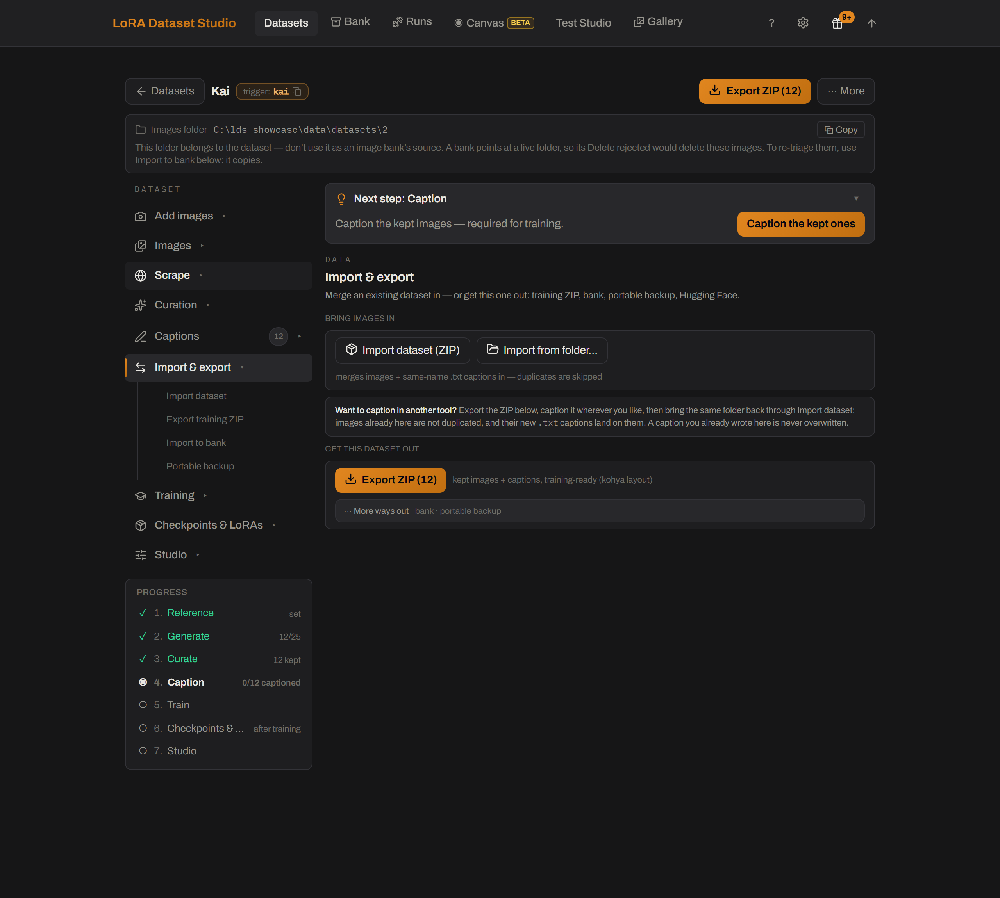

---

[← Documentation index](../README.md) · [Task-level guide](using-the-app.md) · [Troubleshooting](troubleshooting.md)
